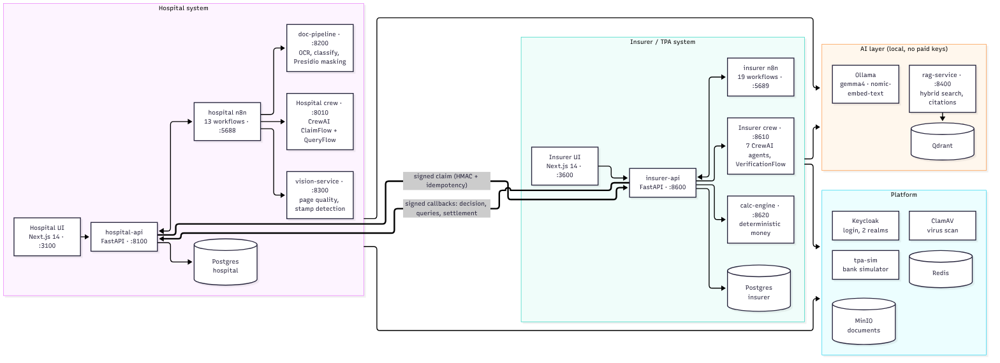
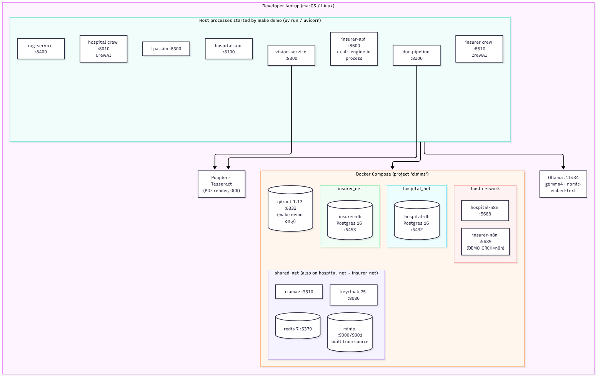
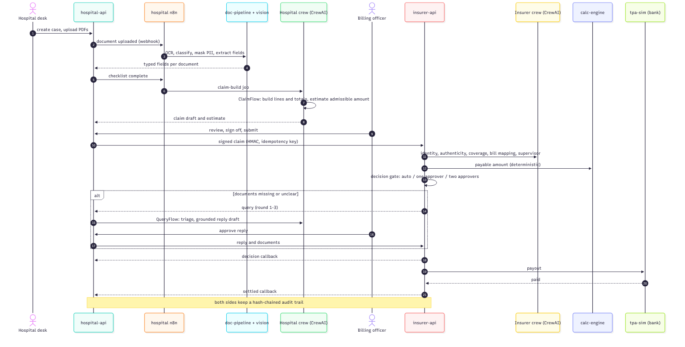
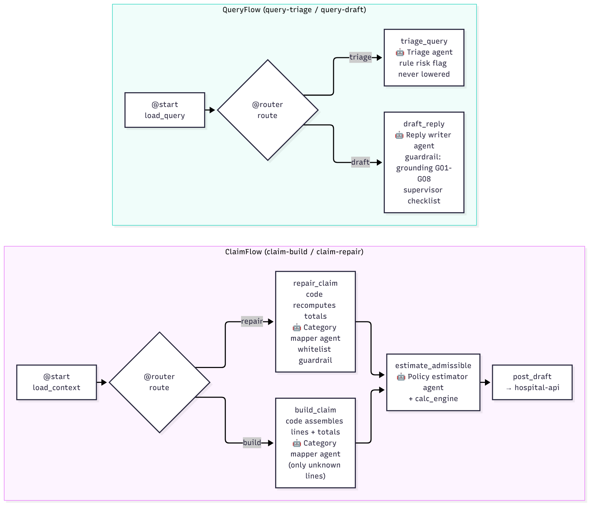
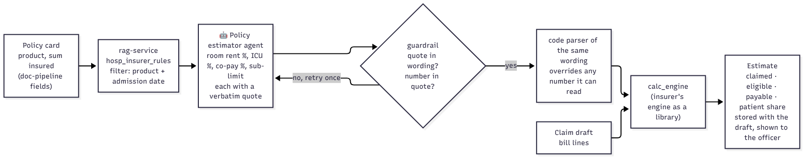
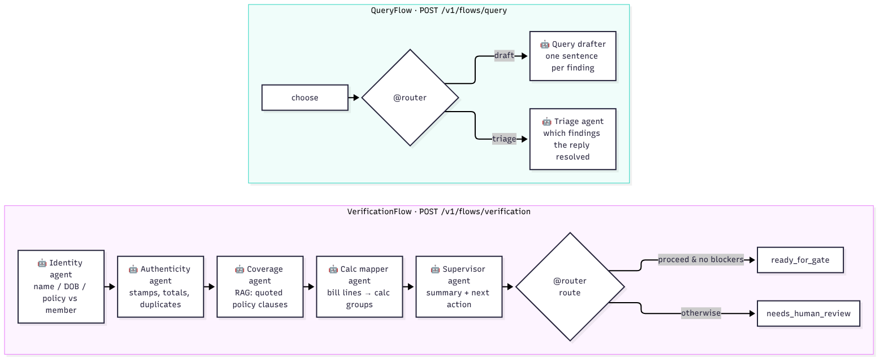
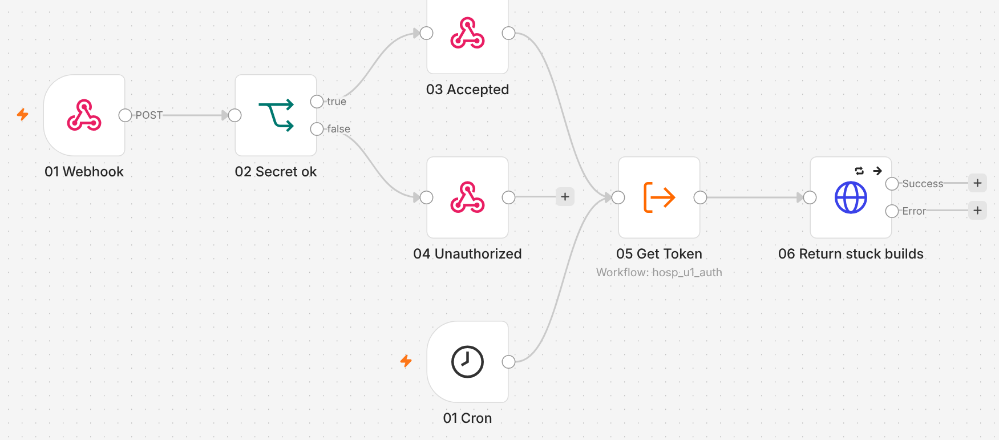
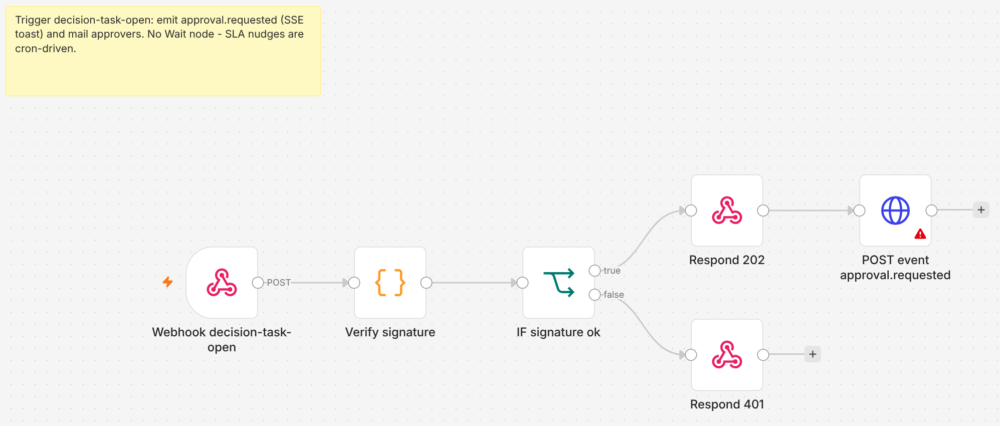
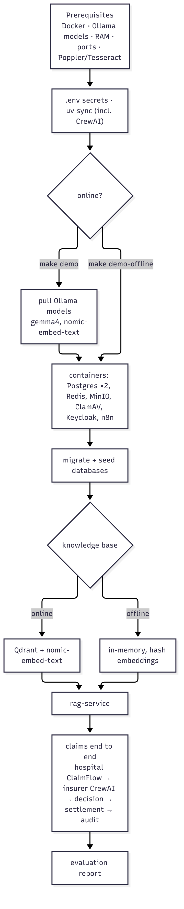

# MediClaim Orchestrator: multi-agent cashless and reimbursement claim processing

Two independent systems, a **hospital** and an **insurer / TPA**, process a health-insurance claim from the first
uploaded document to the bank payout. **CrewAI** agents read the documents and the policy, **deterministic code** decides
every number and every gate, **n8n** runs the business workflows, and humans approve anything above the thresholds.
Everything runs locally on open models (Ollama), with synthetic data only and no paid API keys.


```bash
make demo-offline   # the whole system end to end with no model, about 2-3 minutes
make demo           # the same on the real local model (gemma4 via Ollama)
```

---

## Contents

1. [The problem](#1-the-problem)
2. [What the system does](#2-what-the-system-does)
3. [Results](#3-results)
4. [Architecture](#4-architecture)
5. [How a claim flows](#5-how-a-claim-flows)
6. [The agents (CrewAI)](#6-the-agents-crewai)
7. [Workflows (n8n)](#7-workflows-n8n)
8. [Tech stack and why](#8-tech-stack-and-why)
9. [Privacy, safety and audit](#9-privacy-safety-and-audit)
10. [Run it](#10-run-it)
11. [Repository layout](#11-repository-layout)
12. [Tests and evaluation](#12-tests-and-evaluation)
13. [Documentation](#13-documentation)
14. [Known limitations and next steps](#14-known-limitations-and-next-steps)

---

## 1. The problem

In India, a cashless claim leaves the hospital as a bundle of scanned bills, a discharge summary, prescriptions, ID proof
and a policy card. Today the hospital's billing desk assembles it by hand, guesses what the insurer will pay, and waits
while the insurer's TPA checks identity, authenticity and coverage, applies room-rent caps, sub-limits and co-pays, and
sends queries back for missing papers. Discharge can wait hours on this back-and-forth, and errors on either side cause
rejections, short payments and repeated queries.

**Goal:** cut discharge-to-approval time from hours to minutes, catch problems before submission, and keep every decision
explainable, auditable and, above set amounts, approved by a person.

## 2. What the system does

| Side | What it automates | Who still decides |
|---|---|---|
| **Hospital** | Reads every uploaded document (OCR, classification, field extraction, PII masking), checks completeness, builds the claim from the bills, **estimates the admissible amount from the patient's policy before submission**, answers insurer queries with grounded drafts | The billing officer reviews, edits and signs off; query replies need approval |
| **Insurer / TPA** | Verifies identity, authenticity and coverage with agents, maps bill lines, calculates the payable amount, routes the decision, raises queries, settles through the bank | Reviewers approve above ₹50,000; two approvers above ₹5,00,000; any blocker sends the claim to a person |

Design principles (from the architecture plan, kept throughout):

1. **Deterministic first.** Routing, completeness, identity matching, arithmetic and payout are code. Language models only
   read unstructured text, map lines and draft text, and code checks and can override their answers.
2. **Configuration over code.** Document lists, thresholds and policy rules are versioned data.
3. **Human authority.** The system recommends; people decide above the thresholds.
4. **Privacy by construction.** Identity never reaches a model; text is masked first; models run locally.
5. **Evidence over confidence.** Gates use parser confidence, quotes and code checks, never a model's self-reported confidence.
6. **Everything auditable.** Every agent output, edit and approval is an append-only, hash-chained event.

## 3. Results

| Run | Where | Outcome |
|---|---|---|
| `make demo` (real model, gemma4) | MacBook Air, Apple Silicon | **DEMO PASSED**: claim built by the hospital CrewAI flow, verified by the insurer CrewAI agents, auto-approved, settled, audit chains verified; claim run 166 s |
| `make demo-offline` | MacBook Air, Apple Silicon | **DEMO PASSED**: same pipeline with no model; claim run 35 s |
| `DEMO_SCENARIO=all make demo-offline` | Linux | **7/7 scenarios passed** in about 2.5 minutes: auto-approval, reviewer, dual approval, rejection, three query rounds with escalation, duplicate/out-of-order callbacks, bank payout retry |
| Automated tests | Linux | 1,000+ tests pass (contract, both APIs, both crews, calc engine, doc-pipeline, vision, RAG, simulators, data) |

Evaluation report (`make demo` prints it; 300 synthetic cases, seed 42):

| Suite | Metric | Value | Target |
|---|---|---|---|
| calc | agreement with an independent reference calculator | 1.00 | 0.995 |
| gate | decision route correctness | 1.00 | 1.00 |
| gate | wrongful automatic approvals | 0.00 | 0.00 |
| mapper | bill-line mapping accuracy | 1.00 | 0.97 |
| identity | match recall / mismatch recall | 1.00 / 1.00 | 0.98 / 0.95 |
| rag | recall@5 · MRR · nDCG@5 | 0.93 · 0.80 · 0.83 | 0.85 · 0.60 · 0.70 |
| rag | citation precision | **0.61** | 0.90 (open, see §14) |
| rag | insufficient-evidence · temporal-trap · numeric faithfulness | 1.00 · 1.00 · 1.00 | 0.90 · 0.95 · 1.00 |

## 4. Architecture



Each side owns its API, database, workflows, agents and UI; they talk only through a versioned, HMAC-signed REST contract
with idempotency keys. Shared services are stateless or namespaced per side (for example, the hospital's knowledge-base
token cannot read the insurer's collections).

How it is deployed: containers (Docker Compose) for the stateful and third-party parts, host processes for our services.



## 5. How a claim flows



## 6. The agents (CrewAI)

Both sides use **CrewAI** (`crewai==1.15.23`): every model call is a CrewAI **Agent** running a **Task** in a sequential
**Crew**, and **Flows** (`@start`, `@listen`, `@router`) own the order of steps and the shared state. Deterministic checks
are **task guardrails**: a bad answer goes back to the agent with the problems, then code has the last word.

### Hospital crew (`hospital/crew`)



| Agent | Job | What code still decides |
|---|---|---|
| Category mapper | Labels bill lines the keyword table cannot place | Totals, line assembly; labels outside the allowed set are ignored |
| Policy estimator | Reads the policy wording: room rent %, ICU %, co-pay %, procedure sub-limit, each with a verbatim quote | Quotes must be in the wording and contain the number; a code parser overrides numbers it can read; the calc engine computes money |
| Query triage officer | Sorts an insurer query: send documents or clarify; escalation risk | A rule-based risk flag can be raised, never lowered |
| Claims desk reply writer | Drafts a polite reply grounded in numbered sources | Grounding rules G01-G08 (no invented numbers, verbatim quotes, no promises or links); supervisor checklist |

### Admissible-amount estimate (before submission)



The officer sees, before sign-off, what the insurer is likely to pay and why, with the policy clauses quoted.

### Insurer crew (`insurer/crew`)



| Agent | Job | What code still decides |
|---|---|---|
| Identity | Reconciles patient, member and ID-document fields | Name score, DOB and policy matches are computed facts the agent cannot contradict |
| Authenticity | Explains stamp, total, duplicate and tamper signals | Signals come from code; an anomaly without a signal or evidence is dropped |
| Coverage | Finds and quotes policy clauses (RAG) | Quotes must appear in the retrieved text; otherwise "insufficient evidence" |
| Calc mapper | Maps unknown bill lines to calculation groups | Keyword rules first; the calc engine is the money authority |
| Supervisor | Summarises steps for the reviewer, recommends the next action | "Proceed" is downgraded when any blocker exists |
| Query drafter | Writes the query to the hospital, one sentence per finding | Forbidden phrases and invented amounts are stripped; template fills gaps |
| Triage | Decides which findings the hospital's reply resolved | A code check of attached documents overrides the verdict |

Every agent reaches the model through a small bridge (`crewai_bridge.py` / `crewai_team.py`) that keeps the PII guard,
circuit breaker, JSON repair, token accounting and tracing in front of each call. CrewAI memory and knowledge are off
(they default to OpenAI embeddings), and telemetry is opted out.

Run them alone, no Docker needed: `make crew-demo`, `make ins-crew-demo`; draw the flows: `make crew-plot`.

## 7. Workflows (n8n)

| Hospital n8n (13) | Insurer n8n (19) |
|---|---|
| Intake (per document), completeness loop, claim build, submission watch, query intake, query draft, query SLA, reminders, sweeper, error handler, auth, idempotency, polling helpers | Common error handler, token, API and crew callers, event emitter, verification main + steps (document fetch, completeness, identity, authenticity, coverage, calculation), decision gate and final decision, query sent / response, escalation, settlement, SLA and housekeeping cron |

Flows are generated from code (`hospital/n8n/build_flows.py`, `insurer/n8n/build_flows.py`) and linted; the hospital
flows are tested against a real n8n container and run in every demo. The insurer flows run when `DEMO_ORCH=n8n`.

The real workflows in the n8n editor (all of them are in [`docs/images/n8n/`](docs/images/n8n/)):




## 8. Tech stack and why

| Layer | Technology | Why this choice |
|---|---|---|
| Agents | **CrewAI 1.15.23** (Agents, Tasks, Crews, Flows, guardrails) | Role-based agents with explicit flows and guardrails; Flows give a clear, plottable order of steps |
| Models | **Ollama**: `gemma4:latest` (reasoning), `nomic-embed-text` (embeddings) | Free, local, no provider keys; patient data never leaves the machine |
| Workflow automation | **n8n 2.41.6** | Visual, auditable business workflows: triggers, webhooks, waits, reminders, escalations |
| APIs | **FastAPI**, **Pydantic 2**, **SQLAlchemy 2**, **Alembic** | Typed request/response contracts, async I/O, versioned migrations |
| Databases | **PostgreSQL 16** (one per side) | Transactions, JSONB for documents and audit; strict separation of the two systems |
| Knowledge base | **rag-service** (own hybrid dense + sparse search with reranking and citations) on **Qdrant 1.12** | Policy wording retrieval with metadata filters (product, effective date) and quotable chunks |
| Money | **calc-engine** (pure Python, Decimal) | Room-rent proportional deduction, sub-limits, co-pay, deductible and sum-insured caps must be exact and testable, never an LLM |
| Documents | **Poppler** (`pdftoppm`, `pdftotext`), **Tesseract** OCR, **OpenCV**, **Presidio** + spaCy | Text and image extraction from scans; stamp and quality checks; PII detection and masking |
| Storage / security | **MinIO** (built from source), **ClamAV**, **Keycloak 25**, **Redis 7** | S3-style encrypted document store, virus scanning, login with roles in two realms, queues and SSE |
| UIs | **Next.js 14**, React 18, TanStack Query, Tailwind | Desk, officer, reviewer, approver and admin screens |
| Simulation | **tpa-sim**, synthetic data (Faker, ReportLab, degraded scans) | Realistic end-to-end runs with no real patients, insurers or banks |
| Tooling | **uv**, **Docker Compose**, ruff, mypy, pytest, Playwright, vitest | One-command setup and reproducible checks |

Course-tool note: Qdrant stands in for Pinecone (local, free, metadata filtering) and Langfuse (optional, self-hosted)
for LangSmith; the reasons are the same as for Ollama: no paid keys and no patient data leaving the machine.

## 9. Privacy, safety and audit

- **DPDP-minded by design:** identity documents never go to a model; text is masked with Presidio; a regex PII guard
  (Aadhaar, PAN, phone, e-mail) runs before every model call; all models are local; CrewAI telemetry is off.
- **Prompt-injection resistance:** document text is wrapped as untrusted data; injected instructions are neutralised and
  cannot change a decision (tested with a 20-document injection corpus).
- **Signed inter-system traffic:** HMAC signatures and idempotency keys on every hospital-insurer message.
- **Audit:** append-only, hash-chained audit trails on both sides, verified at the end of every demo run.
- **Synthetic data only:** members, policies, hospitals and documents are generated.

## 10. Run it

**Prerequisites**

| Need | Mac | Linux |
|---|---|---|
| Docker | Docker Desktop, with *Settings → Resources → Network → Enable host networking* | Docker Engine + Compose v2 |
| Python tooling | `uv` (`brew install uv`) | `uv` |
| PDF and OCR tools | `brew install poppler tesseract` | `sudo apt-get install -y poppler-utils tesseract-ocr` |
| Models (for `make demo`) | Ollama, then `ollama pull gemma4:latest` and `ollama pull nomic-embed-text` (the demo pulls missing ones) | same |
| Memory | 16 GB RAM (32 GB preferred) | same |

**One command**

```bash
git clone https://github.com/Multi-Agent-MediClaim-Orchestrator/Sohail-Ahmed.git && cd Sohail-Ahmed
make demo-check                          # prerequisites only
make demo-offline                        # no model, about 2-3 minutes
DEMO_SCENARIO=all make demo-offline      # all 7 claim scenarios
make demo                                # real local model
make demo-down                           # stop everything (data kept)
```



**Pieces on their own**: `make crew-demo` / `make ins-crew-demo` (CrewAI flows, no Docker), `make check-crew` (insurer
agents on the real model, known-answer checks), `make run-ui` (hospital UI on :3100), `make test`, `make test-insurer`.
Step-by-step commands and what each one runs: [`docs/demo/01-RUNBOOK.md`](docs/demo/01-RUNBOOK.md).

**Ports**

| Service | Port | Service | Port |
|---|---|---|---|
| hospital UI | 3100 | insurer UI | 3600 |
| hospital-api | 8100 | insurer-api | 8600 |
| hospital crew (CrewAI) | 8010 | insurer crew (CrewAI) | 8610 |
| doc-pipeline | 8200 | calc-engine | 8620 |
| vision-service | 8300 | rag-service | 8400 |
| hospital n8n | 5688 | insurer n8n | 5689 |
| tpa-sim (bank) | 8500 | Keycloak | 8080 |
| Postgres hospital / insurer | 5432 / 5453 | Redis · MinIO · ClamAV · Qdrant · Ollama | 6379 · 9000 · 3310 · 6333 · 11434 |

## 11. Repository layout

```
contract/            shared API contract: models, enums, state machines, HMAC signing, idempotency, audit chain
hospital/
  api/               hospital-api (FastAPI, Alembic migrations, completeness, router, claim builder, queries)
  crew/              hospital CrewAI flows and agents, policy estimate      → hospital/crew/README.md
  n8n/               13 generated workflows
  ui/                Next.js desk / officer / admin
insurer/
  api/               insurer-api (receipt, verification engine, decision gate, queries, settlement)
  crew/              insurer CrewAI agents and flows
  calc_engine/       deterministic payout calculator
  n8n/               19 generated workflows
  ui/                Next.js reviewer / approver / admin
services/
  doc-pipeline/      parse, classify, mask, extract
  vision-service/    page quality, stamp detector
  rag-service/       knowledge base and hybrid search
  tpa-sim/           insurer / bank simulator
data/                synthetic data generator and evaluation harness
eval/                insurer-side evaluation (run_eval.py)
infra/               Docker Compose, Keycloak, MinIO, Redis, ClamAV, Postgres init
scripts/             demo.py (make demo), end-to-end runs, checks
docs/                plan, decisions, runbook, diagrams
```

## 12. Tests and evaluation

```bash
uv run pytest hospital/crew insurer/crew -q   # CrewAI layers (fast, no services)
make test                                     # contract, hospital, crew, doc-pipeline, vision, data
make test-insurer                             # calc engine, insurer crew, n8n flows, tpa-sim, RAG, insurer-api
uv run python eval/run_eval.py --n 300        # evaluation report
```

## 13. Documentation

| Document | What it covers |
|---|---|
| [`docs/report/MediClaim_Project_Report.pdf`](docs/report/MediClaim_Project_Report.pdf) ([docx](docs/report/MediClaim_Project_Report.docx)) | Full project report: problem, design, workflows, results, roadmap, references, appendices |
| [`docs/guide/MediClaim_Explained_Simply.pdf`](docs/guide/MediClaim_Explained_Simply.pdf) | The project in plain English: problem, choices, every tool, parameters, likely viva questions |
| [`docs/guide/MediClaim_Workflows_Explained.pdf`](docs/guide/MediClaim_Workflows_Explained.pdf) | Every n8n workflow in plain English: trigger, steps, why, with screenshots |
| [`docs/report/MediClaim_Tech_Stack.pdf`](docs/report/MediClaim_Tech_Stack.pdf) ([docx](docs/report/MediClaim_Tech_Stack.docx)) | Each technology, why it is used, its parameters, and every `make` command |
| [`docs/demo/01-RUNBOOK.md`](docs/demo/01-RUNBOOK.md) | Every command, what it runs, where to look |
| [`docs/demo/02-HOW-IT-WORKS.md`](docs/demo/02-HOW-IT-WORKS.md) | Which file does what, end to end |
| [`docs/demo/03-WORKFLOW.md`](docs/demo/03-WORKFLOW.md) | A claim's journey step by step |
| [`docs/CREWAI_MIGRATION_PLAN.md`](docs/CREWAI_MIGRATION_PLAN.md) | Gap analysis and how CrewAI was introduced |
| [`docs/DECISIONS.md`](docs/DECISIONS.md) | Every design decision and deviation, dated |
| [`hospital/crew/README.md`](hospital/crew/README.md) | Hospital flows, agents and the estimate in detail |
| [`docs/implementation/`](docs/implementation/) | The full specification set |
| [`docs/diagrams/`](docs/diagrams/) | Diagram sources (Mermaid) and interactive CrewAI flow plots |

Diagrams are rendered from `docs/diagrams/src/*.mmd` with `make diagrams`.

## 14. Known limitations and next steps

- **RAG citation precision 0.61 vs 0.9**: measured with offline stub embeddings; to be re-measured with real embeddings
  and improved.
- **Missing success metrics**: manual baseline, time to submit, queries per claim, estimate accuracy against the
  insurer's final amount.
- **Synthetic data mismatch**: the HEALTH-PLUS-GOLD wording in force before June 2026 says 20% co-pay, the insurer's rules
  say 0%, so early-2026 estimates read lower than the insurer pays.
- **Orchestration**: insurer-api still sequences verification itself (or via n8n) and calls each CrewAI agent per step;
  the CrewAI `VerificationFlow` is used by `crewai run`, the checks and the evaluation.
- **Speed on CPU**: a real-model query draft can take minutes on a laptop.
