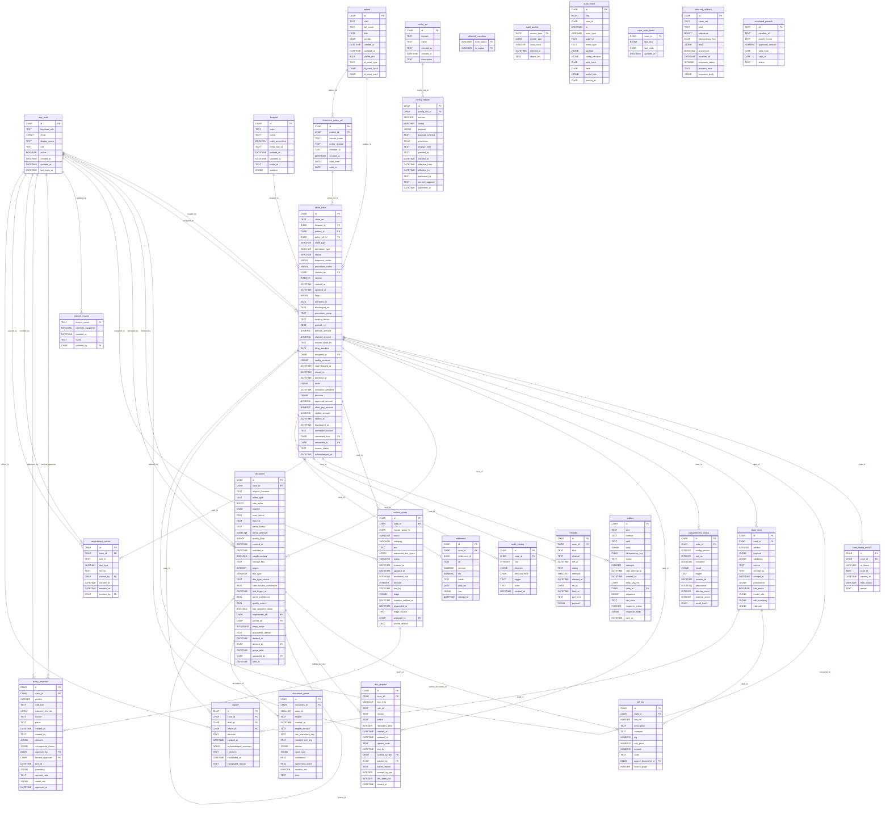

# Hospital DB ER diagram (generated by scripts/gen_er.py)

```mermaid
erDiagram
  claim_draft ||--o{ bill_line : "draft_id"
  document ||--o{ bill_line : "source_document_id"
  claim_case ||--o{ case_status_history : "case_id"
  app_user ||--o{ claim_case : "created_by"
  hospital ||--o{ claim_case : "hospital_id"
  patient ||--o{ claim_case : "patient_id"
  app_user ||--o{ claim_case : "assigned_to"
  claim_case ||--o{ claim_case : "converted_from"
  claim_case ||--o{ claim_case : "converted_to"
  insurance_policy_ref ||--o{ claim_case : "policy_ref_id"
  claim_case ||--o{ claim_draft : "case_id"
  claim_case ||--o{ completeness_check : "case_id"
  config_set ||--o{ config_version : "config_set_id"
  claim_case ||--o{ doc_request : "case_id"
  app_user ||--o{ doc_request : "waived_by"
  document ||--o{ doc_request : "fulfilled_by_doc"
  document ||--o{ document : "supersedes_id"
  document ||--o{ document : "parent_id"
  app_user ||--o{ document : "deleted_by"
  app_user ||--o{ document : "uploaded_by"
  claim_case ||--o{ document : "case_id"
  document ||--o{ document_parse : "document_id"
  patient ||--o{ insurance_policy_ref : "patient_id"
  claim_case ||--o{ insurer_query : "case_id"
  app_user ||--o{ insurer_query : "assigned_to"
  app_user ||--o{ network_insurer : "updated_by"
  claim_case ||--o{ outbox : "case_id"
  app_user ||--o{ query_response : "second_approver"
  app_user ||--o{ query_response : "approved_by"
  insurer_query ||--o{ query_response : "query_id"
  claim_case ||--o{ reminder : "case_id"
  app_user ||--o{ requirement_waiver : "revoked_by"
  app_user ||--o{ requirement_waiver : "waived_by"
  claim_case ||--o{ requirement_waiver : "case_id"
  claim_case ||--o{ route_history : "case_id"
  claim_case ||--o{ settlement : "case_id"
  claim_draft ||--o{ signoff : "draft_id"
  claim_case ||--o{ signoff : "case_id"
  app_user ||--o{ signoff : "officer_id"
  allowed_transition {
    VARCHAR from_status PK
    VARCHAR to_status PK
  }
  app_user {
    CHAR id PK
    TEXT keycloak_sub
    CITEXT email
    TEXT display_name
    TEXT role
    BOOLEAN active
    DATETIME created_at
    DATETIME updated_at
    DATETIME last_login_at
  }
  audit_anchor {
    DATE anchor_date PK
    CHAR merkle_root
    INTEGER case_count
    DATETIME created_at
    TEXT object_key
  }
  audit_event {
    CHAR id PK
    BIGINT seq
    CHAR case_id
    DATETIME ts
    VARCHAR actor_type
    TEXT actor_id
    TEXT event_type
    JSONB payload
    JSONB config_versions
    CHAR prev_hash
    CHAR hash
    JSONB model_info
    CHAR journey_id
  }
  bill_line {
    CHAR id PK
    CHAR draft_id FK
    INTEGER line_no
    TEXT description
    TEXT category
    NUMERIC qty
    NUMERIC unit_price
    NUMERIC amount
    TEXT code
    CHAR source_document_id FK
    INTEGER source_page
  }
  case_audit_head {
    CHAR case_id PK
    BIGINT last_seq
    CHAR last_hash
    DATETIME updated_at
  }
  case_status_history {
    CHAR id PK
    CHAR case_id FK
    VARCHAR to_status
    TEXT actor_id
    DATETIME created_at
    VARCHAR from_status
    TEXT reason
  }
  claim_case {
    CHAR id PK
    TEXT claim_ref
    CHAR hospital_id FK
    CHAR patient_id FK
    CHAR policy_ref_id FK
    VARCHAR claim_type
    VARCHAR admission_type
    VARCHAR status
    ARRAY diagnosis_codes
    ARRAY procedure_codes
    CHAR created_by FK
    INTEGER version
    DATETIME created_at
    DATETIME updated_at
    ARRAY flags
    DATE admitted_on
    DATE discharged_on
    TEXT procedure_group
    TEXT treating_doctor
    TEXT preauth_ref
    NUMERIC preauth_amount
    NUMERIC claimed_amount
    TEXT insurer_claim_no
    DATE filing_deadline
    CHAR assigned_to FK
    JSONB config_versions
    DATETIME stale_flagged_at
    DATETIME closed_at
    DATETIME admitted_at
    JSONB route
    DATETIME intimation_deadline
    JSONB decision
    NUMERIC approved_amount
    NUMERIC short_pay_amount
    NUMERIC settled_amount
    DATETIME settled_at
    DATETIME discharged_at
    TEXT admission_source
    CHAR converted_from FK
    CHAR converted_to FK
    TEXT insurer_status
    DATETIME acknowledged_at
  }
  claim_draft {
    CHAR id PK
    CHAR case_id FK
    INTEGER version
    JSONB payload
    JSONB validation
    TEXT source
    TEXT created_by
    DATETIME created_at
    JSONB provenance
    BOOLEAN has_errors
    JSONB model_info
    JSONB edit_summary
    JSONB estimate
  }
  completeness_check {
    CHAR id PK
    CHAR case_id FK
    INTEGER config_version
    INTEGER run_no
    BOOLEAN complete
    JSONB result
    TEXT trigger
    DATETIME created_at
    BOOLEAN provisional
    INTEGER blocker_count
    INTEGER warning_count
    CHAR result_hash
  }
  config_set {
    CHAR id PK
    TEXT domain
    TEXT name
    TEXT created_by
    DATETIME created_at
    TEXT description
  }
  config_version {
    CHAR id PK
    CHAR config_set_id FK
    INTEGER version
    VARCHAR status
    JSONB payload
    TEXT payload_schema
    CHAR checksum
    TEXT change_note
    TEXT created_by
    DATETIME created_at
    DATETIME effective_from
    DATETIME effective_to
    TEXT published_by
    TEXT second_approver
    DATETIME published_at
  }
  doc_request {
    CHAR id PK
    CHAR case_id FK
    VARCHAR doc_type
    TEXT rule_id
    TEXT reason
    TEXT status
    INTEGER reminders_sent
    DATETIME created_at
    DATETIME updated_at
    TEXT reason_code
    DATETIME due_by
    CHAR fulfilled_by_doc FK
    CHAR waived_by FK
    TEXT waive_reason
    INTEGER opened_by_run
    INTEGER last_seen_run
    DATETIME closed_at
  }
  document {
    CHAR id PK
    CHAR case_id FK
    TEXT original_filename
    TEXT mime_type
    BIGINT size_bytes
    CHAR sha256
    TEXT scan_status
    TEXT lifecycle
    TEXT parse_status
    SMALLINT parse_attempts
    ARRAY quality_flags
    DATETIME created_at
    DATETIME updated_at
    BOOLEAN supplementary
    TEXT storage_key
    INTEGER pages
    VARCHAR doc_type
    TEXT doc_type_source
    REAL classification_confidence
    DATETIME last_trigger_at
    REAL parse_confidence
    REAL quality_score
    BOOLEAN has_required_stamp
    CHAR supersedes_id FK
    CHAR parent_id FK
    INT4RANGE page_range
    TEXT quarantine_reason
    DATETIME deleted_at
    CHAR deleted_by FK
    DATETIME purge_after
    CHAR uploaded_by FK
    DATETIME sent_at
  }
  document_parse {
    CHAR id PK
    CHAR document_id FK
    SMALLINT pass_no
    TEXT engine
    DATETIME created_at
    TEXT engine_version
    TEXT raw_markdown_key
    TEXT masked_text_key
    JSONB entities
    JSONB typed_json
    REAL confidence
    REAL agreement_score
    INTEGER duration_ms
    TEXT error
  }
  hospital {
    CHAR id PK
    TEXT code
    TEXT name
    BOOLEAN nabh_accredited
    TEXT hmac_key_id
    DATETIME created_at
    DATETIME updated_at
    TEXT rohini_id
    JSONB address
  }
  inbound_callback {
    CHAR id PK
    TEXT claim_ref
    TEXT kind
    BIGINT sequence
    CHAR idempotency_key
    JSONB body
    BOOLEAN processed
    DATETIME received_at
    INTEGER response_status
    TEXT process_error
    JSONB response_body
  }
  insurance_policy_ref {
    CHAR id PK
    CHAR patient_id FK
    TEXT insurer_name
    TEXT policy_number
    TEXT member_id
    DATETIME created_at
    DATE valid_from
    DATE valid_to
  }
  insurer_query {
    CHAR id PK
    CHAR case_id FK
    CHAR insurer_query_id
    SMALLINT round
    VARCHAR category
    TEXT text
    ARRAY requested_doc_types
    VARCHAR status
    DATETIME created_at
    DATETIME updated_at
    BOOLEAN escalation_risk
    INTEGER revision
    DATETIME due_by
    JSONB triage
    DATETIME overdue_notified_at
    DATETIME responded_at
    TEXT triage_source
    CHAR assigned_to FK
    TEXT closed_reason
  }
  network_insurer {
    TEXT insurer_name PK
    BOOLEAN cashless_supported
    DATETIME updated_at
    TEXT notes
    CHAR updated_by FK
  }
  outbox {
    CHAR id PK
    TEXT kind
    TEXT method
    TEXT path
    JSONB body
    CHAR idempotency_key
    TEXT status
    INTEGER attempts
    DATETIME next_attempt_at
    DATETIME created_at
    CHAR body_sha256
    CHAR case_id FK
    BIGINT sequence
    TEXT last_error
    INTEGER response_status
    JSONB response_body
    DATETIME sent_at
  }
  patient {
    CHAR id PK
    TEXT uhid
    TEXT full_name
    DATE dob
    CHAR gender
    DATETIME created_at
    DATETIME updated_at
    BLOB phone_enc
    TEXT id_proof_type
    CHAR id_proof_hash
    CHAR id_proof_last4
  }
  query_response {
    CHAR id PK
    CHAR query_id FK
    INTEGER version
    TEXT draft_text
    ARRAY attached_doc_ids
    TEXT source
    TEXT status
    DATETIME created_at
    TEXT created_by
    JSONB citations
    JSONB unsupported_claims
    CHAR approved_by FK
    CHAR second_approver FK
    DATETIME sent_at
    JSONB grounding
    TEXT override_note
    JSONB model_info
    DATETIME approved_at
  }
  reminder {
    CHAR id PK
    CHAR case_id FK
    TEXT kind
    TEXT channel
    DATETIME fire_at
    TEXT status
    SMALLINT attempts
    DATETIME created_at
    CHAR ref_id
    DATETIME fired_at
    TEXT last_error
    JSONB payload
  }
  requirement_waiver {
    CHAR id PK
    CHAR case_id FK
    TEXT rule_id
    VARCHAR doc_type
    TEXT reason
    CHAR waived_by FK
    DATETIME created_at
    DATETIME revoked_at
    CHAR revoked_by FK
  }
  route_history {
    CHAR id PK
    CHAR case_id FK
    INTEGER seq
    JSONB decision
    CHAR decision_hash
    TEXT trigger
    TEXT actor
    DATETIME created_at
  }
  settlement {
    CHAR id PK
    CHAR case_id FK
    CHAR settlement_id
    TEXT utr
    NUMERIC amount
    NUMERIC tds
    TEXT mode
    DATE paid_on
    JSONB raw
    DATETIME created_at
  }
  signoff {
    CHAR id PK
    CHAR case_id FK
    CHAR draft_id FK
    CHAR officer_id FK
    TEXT decision
    DATETIME created_at
    ARRAY acknowledged_warnings
    TEXT comment
    DATETIME invalidated_at
    TEXT invalidated_reason
  }
  simulated_preauth {
    TEXT ref PK
    TEXT member_id
    TEXT insurer_name
    NUMERIC approved_amount
    DATE valid_from
    DATE valid_to
    TEXT status
  }
```
