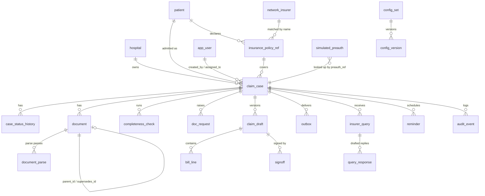

# 02-01 — hospital-db: Schema, Migrations, Seed Data

Status: PROPOSED. Owner: Dev A. Container: `hospital-db` (PostgreSQL 16, port 5432). Code: `hospital/api/alembic/`, `hospital/api/app/models/`, `hospital/api/seed/`.

## 1. Goal
Define the complete hospital-side schema (the "section 8" referenced in the architecture file), the Alembic migration chain, DB roles, triggers and seed data so every other Dev A doc can assume the tables exist. The DB is private to hospital-api; no other service connects to it. The one exception is n8n, which gets its own separate database `n8n` (role `n8n_app`) on the same server and never touches the `hospital` database (see doc 08 §3).

This document is also the **single reconciliation point** for every column and table that docs 02–10 introduce. Section 3.6 lists each addition, the doc that needs it, and the migration that carries it. If another doc needs a new column, it must be added here first.

Out of scope: insurer-side tables (Dev B, `03-dev-B-insurer/01-insurer-db.md`), n8n's own internal schema, Redis keyspaces (documented in the owning API docs).

## 2. Inputs / Outputs
- Inputs: enums and models from `01-shared-contract/02-data-models-and-enums.md`; config pattern from `01-03`; audit design from `01-04`; conventions from `01-05`.
- Outputs:
  - Alembic revisions `0001`–`0013` under `hospital/api/alembic/versions/`.
  - SQLAlchemy 2 models, one module per migration group, under `hospital/api/app/models/`.
  - DB roles `hosp_owner`, `hosp_app`, `hosp_readonly`, `n8n_app`.
  - Seed data (`make seed`): 1 hospital, 9 users (3 per role), 20 patients, 4 config sets at v1, `allowed_transition`, `network_insurer`, `simulated_preauth`.
  - ER diagram `docs/er-hospital.md` (mermaid).
  - Enum-parity and drift tests.

## 3. Data model

### 3.1 Conventions
| Topic | Rule |
|---|---|
| Primary keys | UUIDv7. App-generated by default (`uuid_utils.uuid7()`); SQL function `uuid_generate_v7()` provided for manual inserts and seeds. |
| Timestamps | `timestamptz`, UTC; `created_at`/`updated_at not null default now()`; trigger `set_updated_at()` on every table that has `updated_at`. |
| Money | `numeric(14,2)`. Never `float`/`real`. Contract `Money.amount` maps to this. |
| Quantities | `numeric(10,3)`. |
| JSONB | Payload columns only; always paired with a schema in the owning doc; max 1 MB (CHECK on `octet_length(payload::text)` for `typed_json` and `payload`). |
| Enums | Postgres `ENUM` types generated from `claim_contract.enums` (see task 3) so they cannot drift. Free-text status columns that are hospital-private use `CHECK (... IN (...))`. |
| Soft delete | Not used for cases. Documents use a lifecycle (`active/superseded/deleted/quarantined`) with tombstone, never row deletion. |
| Naming | snake_case plural for join-ish tables is avoided; singular table names (`claim_case`, `document`). Constraint names deterministic via SQLAlchemy `naming_convention` (`ix_`, `uq_`, `ck_`, `fk_`, `pk_`). |
| Text search | `pg_trgm` GIN indexes on patient name, claim_ref, UHID. |
| PII | Raw ID numbers never stored. Phone encrypted app-side (AES-GCM). Names/DOB are stored (needed for claim) but masked before any external LLM call (doc 03 privacy rules in `05-integration-and-eval/03`). |

### 3.2 Entity relationship overview



### 3.3 Tables (DDL)

Order below is the creation order across migrations (see §5). `...` is never used: every table is spelled out.

#### 3.3.1 Identity and reference (migration 0003)

```sql
CREATE TABLE app_user (
  id uuid PRIMARY KEY,
  keycloak_sub text NOT NULL,
  email citext NOT NULL,
  display_name text NOT NULL,
  role text NOT NULL,
  active boolean NOT NULL DEFAULT true,
  last_login_at timestamptz,
  created_at timestamptz NOT NULL DEFAULT now(),
  updated_at timestamptz NOT NULL DEFAULT now(),
  CONSTRAINT uq_app_user_keycloak_sub UNIQUE (keycloak_sub),
  CONSTRAINT ck_app_user_role CHECK (role IN ('desk','officer','admin'))
);
CREATE INDEX ix_app_user_email ON app_user(email);

CREATE TABLE hospital (            -- one row in practice; supports multi-branch later
  id uuid PRIMARY KEY,
  code text NOT NULL,
  name text NOT NULL,
  nabh_accredited boolean NOT NULL DEFAULT false,
  rohini_id text,
  address jsonb,
  hmac_key_id text NOT NULL,       -- X-Key-Id used when signing outbound calls (01-01 §3)
  created_at timestamptz NOT NULL DEFAULT now(),
  updated_at timestamptz NOT NULL DEFAULT now(),
  CONSTRAINT uq_hospital_code UNIQUE (code)
);

CREATE TABLE patient (
  id uuid PRIMARY KEY,
  uhid text NOT NULL,                       -- hospital MRN
  full_name text NOT NULL,
  dob date NOT NULL,
  gender char(1) NOT NULL,
  phone_enc bytea,                          -- AES-GCM, key HOSP_FIELD_KEY
  id_proof_type text,                       -- 'aadhaar'|'pan'|'passport'|'voter'|'dl' (label only)
  id_proof_hash char(64),                   -- SHA-256(pepper || raw); raw NEVER stored
  id_proof_last4 char(4),
  created_at timestamptz NOT NULL DEFAULT now(),
  updated_at timestamptz NOT NULL DEFAULT now(),
  CONSTRAINT uq_patient_uhid UNIQUE (uhid),
  CONSTRAINT ck_patient_gender CHECK (gender IN ('M','F','O')),
  CONSTRAINT ck_patient_dob CHECK (dob <= CURRENT_DATE)
);
CREATE INDEX ix_patient_name_trgm ON patient USING gin (full_name gin_trgm_ops);
CREATE INDEX ix_patient_uhid_trgm ON patient USING gin (uhid gin_trgm_ops);

CREATE TABLE insurance_policy_ref (  -- what the patient declares; truth lives at insurer
  id uuid PRIMARY KEY,
  patient_id uuid NOT NULL REFERENCES patient(id),
  insurer_name text NOT NULL,
  policy_number text NOT NULL,
  member_id text NOT NULL,
  valid_from date,
  valid_to date,
  created_at timestamptz NOT NULL DEFAULT now(),
  CONSTRAINT uq_policy_ref UNIQUE (patient_id, policy_number, member_id),
  CONSTRAINT ck_policy_ref_validity CHECK (valid_to IS NULL OR valid_from IS NULL OR valid_to >= valid_from)
);
CREATE INDEX ix_policy_ref_patient ON insurance_policy_ref(patient_id);
```

#### 3.3.2 Cases (migration 0004; router/decision columns added by 0012/0013 are shown inline and tagged)

```sql
CREATE TABLE claim_case (
  id uuid PRIMARY KEY,
  claim_ref text NOT NULL,                              -- HC-YYYY-NNNNNN
  hospital_id uuid NOT NULL REFERENCES hospital(id),
  patient_id uuid NOT NULL REFERENCES patient(id),
  policy_ref_id uuid NOT NULL REFERENCES insurance_policy_ref(id),
  claim_type claim_type NOT NULL,
  admission_type admission_type NOT NULL,
  status hospital_case_status NOT NULL DEFAULT 'draft',
  admitted_on date,
  admitted_at timestamptz,                              -- [0012] doc 05: timestamp for 24 h intimation
  discharged_on date,
  diagnosis_codes text[] NOT NULL DEFAULT '{}',
  procedure_codes text[] NOT NULL DEFAULT '{}',
  procedure_group text,                                 -- derived by router (doc 05)
  treating_doctor text,
  preauth_ref text,
  preauth_amount numeric(14,2),
  claimed_amount numeric(14,2),
  insurer_claim_no text,                                -- set from Acknowledgement
  route jsonb,                                          -- [0012] RouteDecision (doc 05 §3)
  flags text[] NOT NULL DEFAULT '{}',                   -- [0012] implant, high_value, medico_legal, day_care, maternity, preauth_issue ...
  intimation_deadline timestamptz,                      -- [0012] emergency cashless: admitted_at + 24 h
  filing_deadline date,                                 -- reimbursement: discharged_on + deadlines.reimbursement_filing_days
  decision jsonb,                                       -- [0013] insurer Decision JSON (doc 06 task 10)
  approved_amount numeric(14,2),                        -- [0013] denormalised from decision
  short_pay_amount numeric(14,2),                       -- [0013] claimed_amount - approved_amount
  settled_amount numeric(14,2),                         -- [0013] from SettlementNotice
  settled_at timestamptz,                               -- [0013]
  assigned_to uuid REFERENCES app_user(id),
  created_by uuid NOT NULL REFERENCES app_user(id),
  config_versions jsonb,                                -- ConfigVersions snapshot at creation (01-03 §4)
  stale_flagged_at timestamptz,                         -- doc 03 task 15: abandoned draft > 30 d
  version int NOT NULL DEFAULT 1,                       -- optimistic lock
  closed_at timestamptz,
  created_at timestamptz NOT NULL DEFAULT now(),
  updated_at timestamptz NOT NULL DEFAULT now(),
  CONSTRAINT uq_claim_case_claim_ref UNIQUE (claim_ref),
  CONSTRAINT ck_case_dates CHECK (discharged_on IS NULL OR admitted_on IS NULL OR discharged_on >= admitted_on),
  CONSTRAINT ck_case_amounts CHECK (
        (claimed_amount IS NULL OR claimed_amount >= 0)
    AND (preauth_amount IS NULL OR preauth_amount >= 0)
    AND (approved_amount IS NULL OR approved_amount >= 0)),
  CONSTRAINT ck_case_cashless_preauth_amount CHECK (preauth_amount IS NULL OR claim_type = 'cashless')
);
CREATE INDEX ix_case_status ON claim_case(status);
CREATE INDEX ix_case_patient ON claim_case(patient_id);
CREATE INDEX ix_case_assigned ON claim_case(assigned_to) WHERE assigned_to IS NOT NULL;
CREATE INDEX ix_case_created_keyset ON claim_case(created_at DESC, id DESC);
CREATE INDEX ix_case_deadline ON claim_case(filing_deadline) WHERE status NOT IN ('closed','settled');
CREATE INDEX ix_case_intimation ON claim_case(intimation_deadline) WHERE intimation_deadline IS NOT NULL AND status IN ('draft','docs_pending','docs_complete','building_claim','ready_for_review');
CREATE INDEX ix_case_insurer_claim_no ON claim_case(insurer_claim_no) WHERE insurer_claim_no IS NOT NULL;
CREATE INDEX ix_case_claim_ref_trgm ON claim_case USING gin (claim_ref gin_trgm_ops);
CREATE INDEX ix_case_flags ON claim_case USING gin (flags);

CREATE TABLE case_status_history (
  id uuid PRIMARY KEY,
  case_id uuid NOT NULL REFERENCES claim_case(id),
  from_status hospital_case_status,
  to_status hospital_case_status NOT NULL,
  actor_id text NOT NULL,                       -- user uuid, 'svc-n8n', 'insurer-callback', 'system'
  reason text,
  created_at timestamptz NOT NULL DEFAULT now()
);
CREATE INDEX ix_case_status_history_case ON case_status_history(case_id, created_at);

CREATE TABLE allowed_transition (               -- seeded from contract TRANSITIONS
  from_status hospital_case_status NOT NULL,
  to_status hospital_case_status NOT NULL,
  PRIMARY KEY (from_status, to_status)
);

CREATE SEQUENCE claim_ref_seq_2026;             -- one sequence per year, created by next_claim_ref() on demand
```

#### 3.3.3 Reference tables added by doc 05 (migration 0012)

```sql
CREATE TABLE network_insurer (
  insurer_name text PRIMARY KEY,
  cashless_supported boolean NOT NULL,
  notes text
);

CREATE TABLE simulated_preauth (               -- pre-auth is out of scope; this simulates its record (arch. §1)
  ref text PRIMARY KEY,
  member_id text NOT NULL,
  insurer_name text NOT NULL,
  approved_amount numeric(14,2) NOT NULL,
  valid_from date NOT NULL,
  valid_to date NOT NULL,
  status text NOT NULL,
  CONSTRAINT ck_simulated_preauth_status CHECK (status IN ('approved','enhanced','cancelled','expired')),
  CONSTRAINT ck_simulated_preauth_validity CHECK (valid_to >= valid_from)
);
CREATE INDEX ix_simulated_preauth_member ON simulated_preauth(member_id);
```

#### 3.3.4 Documents (migration 0005)

```sql
CREATE TABLE document (
  id uuid PRIMARY KEY,
  case_id uuid NOT NULL REFERENCES claim_case(id),
  original_filename text NOT NULL,              -- sanitised display name; stored key is generated
  mime_type text NOT NULL,
  size_bytes bigint NOT NULL,
  sha256 char(64) NOT NULL,
  storage_key text NOT NULL,                    -- hospital-docs/<case>/<doc>/original.<ext>
  pages int,
  scan_status text NOT NULL DEFAULT 'pending',
  lifecycle text NOT NULL DEFAULT 'active',     -- active|superseded|deleted|quarantined
  doc_type doc_type,
  doc_type_source text,
  classification_confidence real,
  parse_status text NOT NULL DEFAULT 'pending',
  parse_attempts smallint NOT NULL DEFAULT 0,   -- sweeper (doc 03 §6) stops at 5
  last_trigger_at timestamptz,                  -- sweeper re-trigger bookkeeping
  parse_confidence real,
  quality_score real,
  quality_flags text[] NOT NULL DEFAULT '{}',   -- blurry, skewed, low_light, cropped, illegible_candidate
  has_required_stamp boolean,
  supersedes_id uuid REFERENCES document(id),   -- newer copy replaces older
  parent_id uuid REFERENCES document(id),       -- child produced by splitting a mixed PDF (doc 03 §8)
  page_range int4range,                         -- pages of the parent covered by this child
  quarantine_reason text,
  deleted_at timestamptz,
  deleted_by uuid REFERENCES app_user(id),
  purge_after timestamptz,                      -- tombstone retention (30 d)
  uploaded_by uuid REFERENCES app_user(id),
  created_at timestamptz NOT NULL DEFAULT now(),
  updated_at timestamptz NOT NULL DEFAULT now(),
  CONSTRAINT ck_document_scan_status CHECK (scan_status IN ('pending','clean','infected','error')),
  CONSTRAINT ck_document_lifecycle CHECK (lifecycle IN ('active','superseded','deleted','quarantined')),
  CONSTRAINT ck_document_type_source CHECK (doc_type_source IS NULL OR doc_type_source IN ('auto','manual')),
  CONSTRAINT ck_document_parse_status CHECK (parse_status IN ('pending','processing','parsed','failed','needs_review')),
  CONSTRAINT ck_document_size CHECK (size_bytes > 0 AND size_bytes <= 26214400),
  CONSTRAINT ck_document_conf CHECK (
        (classification_confidence IS NULL OR classification_confidence BETWEEN 0 AND 1)
    AND (parse_confidence IS NULL OR parse_confidence BETWEEN 0 AND 1)
    AND (quality_score IS NULL OR quality_score BETWEEN 0 AND 1)),
  CONSTRAINT ck_document_no_self_ref CHECK (supersedes_id IS NULL OR supersedes_id <> id),
  CONSTRAINT ck_document_infected_lifecycle CHECK (scan_status <> 'infected' OR lifecycle = 'quarantined'),
  CONSTRAINT uq_document_case_sha UNIQUE (case_id, sha256)             -- duplicate upload guard
);
CREATE INDEX ix_doc_case ON document(case_id) WHERE lifecycle = 'active';
CREATE INDEX ix_doc_case_all ON document(case_id);
CREATE INDEX ix_doc_pending_parse ON document(last_trigger_at) WHERE parse_status = 'pending' AND scan_status = 'clean';
CREATE INDEX ix_doc_purge ON document(purge_after) WHERE purge_after IS NOT NULL;
CREATE INDEX ix_doc_parent ON document(parent_id) WHERE parent_id IS NOT NULL;

CREATE TABLE document_parse (          -- one row per parse attempt (two-pass agreement)
  id uuid PRIMARY KEY,
  document_id uuid NOT NULL REFERENCES document(id),
  pass_no smallint NOT NULL,
  engine text NOT NULL,                -- 'mineru-pipeline' | 'crew-llm' | 'vision-ocr'
  engine_version text,
  raw_markdown_key text,               -- MinIO key; raw text may contain PII, never sent out
  masked_text_key text,                -- after Presidio masking
  entities jsonb,
  typed_json jsonb,
  confidence real,
  agreement_score real,                -- filled on pass 2
  duration_ms int,
  error text,
  created_at timestamptz NOT NULL DEFAULT now(),
  CONSTRAINT uq_document_parse_pass UNIQUE (document_id, pass_no),
  CONSTRAINT ck_document_parse_pass CHECK (pass_no BETWEEN 1 AND 3),
  CONSTRAINT ck_document_parse_size CHECK (typed_json IS NULL OR octet_length(typed_json::text) <= 1048576)
);

CREATE TABLE doc_request (            -- needs-info requests raised to patient/desk
  id uuid PRIMARY KEY,
  case_id uuid NOT NULL REFERENCES claim_case(id),
  doc_type doc_type NOT NULL,
  rule_id text,                       -- completeness rule that raised it, e.g. R-IMP-02
  reason text NOT NULL,
  status text NOT NULL DEFAULT 'open',
  due_by timestamptz,
  reminders_sent int NOT NULL DEFAULT 0,
  fulfilled_by_doc uuid REFERENCES document(id),
  waived_by uuid REFERENCES app_user(id),
  waive_reason text,
  created_at timestamptz NOT NULL DEFAULT now(),
  updated_at timestamptz NOT NULL DEFAULT now(),
  CONSTRAINT ck_doc_request_status CHECK (status IN ('open','fulfilled','waived','expired')),
  CONSTRAINT ck_doc_request_waive CHECK (status <> 'waived' OR (waived_by IS NOT NULL AND waive_reason IS NOT NULL))
);
CREATE UNIQUE INDEX uq_doc_request_open ON doc_request(case_id, doc_type) WHERE status = 'open';
CREATE INDEX ix_doc_request_due ON doc_request(due_by) WHERE status = 'open';
```

#### 3.3.5 Completeness, claim building, sign-off (migration 0006)

```sql
CREATE TABLE completeness_check (
  id uuid PRIMARY KEY,
  case_id uuid NOT NULL REFERENCES claim_case(id),
  config_version int NOT NULL,
  run_no int NOT NULL,
  complete boolean NOT NULL,
  result jsonb NOT NULL,        -- {items:[{rule_id, doc_type, requirement, status, severity, document_ids, message}]}
  trigger text,                 -- upload|parse|manual|waive|config
  created_at timestamptz NOT NULL DEFAULT now(),
  CONSTRAINT uq_completeness_run UNIQUE (case_id, run_no)
);

CREATE TABLE claim_draft (
  id uuid PRIMARY KEY,
  case_id uuid NOT NULL REFERENCES claim_case(id),
  version int NOT NULL,
  payload jsonb NOT NULL,                  -- ClaimSubmission minus signed URLs
  validation jsonb,                        -- {errors[], warnings[], reconciliation{lines_sum, bill_total, diff}}
  source text NOT NULL,
  created_by text NOT NULL,
  created_at timestamptz NOT NULL DEFAULT now(),
  CONSTRAINT uq_claim_draft_version UNIQUE (case_id, version),
  CONSTRAINT ck_claim_draft_source CHECK (source IN ('agent','human_edit'))
);

CREATE TABLE bill_line (
  id uuid PRIMARY KEY,
  draft_id uuid NOT NULL REFERENCES claim_draft(id) ON DELETE CASCADE,
  line_no int NOT NULL,
  code text,
  description text NOT NULL,
  category text NOT NULL,
  qty numeric(10,3) NOT NULL,
  unit_price numeric(14,2) NOT NULL,
  amount numeric(14,2) NOT NULL,
  source_document_id uuid REFERENCES document(id),
  source_page int,
  CONSTRAINT uq_bill_line_no UNIQUE (draft_id, line_no),
  CONSTRAINT ck_bill_line_category CHECK (category IN ('room','icu','surgery','anaesthesia','medicine','consumable','implant','investigation','consultation','other')),
  CONSTRAINT ck_bill_line_nonneg CHECK (qty >= 0 AND unit_price >= 0 AND amount >= 0)
);

CREATE TABLE signoff (
  id uuid PRIMARY KEY,
  case_id uuid NOT NULL REFERENCES claim_case(id),
  draft_id uuid NOT NULL REFERENCES claim_draft(id),
  officer_id uuid NOT NULL REFERENCES app_user(id),
  decision text NOT NULL,
  comment text,
  created_at timestamptz NOT NULL DEFAULT now(),
  CONSTRAINT ck_signoff_decision CHECK (decision IN ('approved','returned')),
  CONSTRAINT uq_signoff_officer_draft UNIQUE (draft_id, officer_id)    -- four-eyes: one vote per officer
);
```

#### 3.3.6 Reliable delivery (migration 0007)

```sql
CREATE TABLE outbox (                 -- reliable delivery to insurer (see 01-01 §8)
  id uuid PRIMARY KEY,
  case_id uuid REFERENCES claim_case(id),
  kind text NOT NULL,                 -- claim.submit | documents.supplement | query.response | claim.withdraw
  method text NOT NULL,
  path text NOT NULL,
  body jsonb NOT NULL,
  idempotency_key uuid NOT NULL,
  sequence bigint,                    -- per-claim monotonic (01-01 §8)
  status text NOT NULL DEFAULT 'pending',
  attempts int NOT NULL DEFAULT 0,
  next_attempt_at timestamptz NOT NULL DEFAULT now(),
  last_error text,
  response_status int,
  response_body jsonb,
  created_at timestamptz NOT NULL DEFAULT now(),
  sent_at timestamptz,
  CONSTRAINT uq_outbox_idem UNIQUE (idempotency_key),
  CONSTRAINT ck_outbox_status CHECK (status IN ('pending','sent','failed','dead')),
  CONSTRAINT ck_outbox_method CHECK (method IN ('POST','PUT','GET'))
);
CREATE INDEX ix_outbox_due ON outbox(next_attempt_at) WHERE status IN ('pending','failed');
CREATE INDEX ix_outbox_case ON outbox(case_id, sequence);
CREATE INDEX ix_outbox_dead ON outbox(created_at) WHERE status = 'dead';

CREATE TABLE inbound_callback (       -- dedup/ordering for insurer callbacks
  id uuid PRIMARY KEY,
  claim_ref text NOT NULL,
  kind text NOT NULL,                 -- status|queries|decisions|settlements
  sequence bigint NOT NULL,
  idempotency_key uuid NOT NULL,
  body jsonb NOT NULL,
  processed boolean NOT NULL DEFAULT false,
  process_error text,
  received_at timestamptz NOT NULL DEFAULT now(),
  CONSTRAINT uq_inbound_seq UNIQUE (claim_ref, kind, sequence),
  CONSTRAINT uq_inbound_idem UNIQUE (idempotency_key),
  CONSTRAINT ck_inbound_kind CHECK (kind IN ('status','queries','decisions','settlements'))
);
CREATE INDEX ix_inbound_unprocessed ON inbound_callback(received_at) WHERE processed = false;
```

#### 3.3.7 Queries (migration 0008)

```sql
CREATE TABLE insurer_query (
  id uuid PRIMARY KEY,
  case_id uuid NOT NULL REFERENCES claim_case(id),
  insurer_query_id uuid NOT NULL,
  round smallint NOT NULL,
  category query_category NOT NULL,
  text text NOT NULL,
  requested_doc_types doc_type[] NOT NULL DEFAULT '{}',
  due_by timestamptz,
  status query_status NOT NULL DEFAULT 'open',
  triage jsonb,                       -- {class, urgency, owner_role, needs_docs, auto_draftable}
  overdue_notified_at timestamptz,
  responded_at timestamptz,
  created_at timestamptz NOT NULL DEFAULT now(),
  updated_at timestamptz NOT NULL DEFAULT now(),
  CONSTRAINT uq_insurer_query_id UNIQUE (insurer_query_id),
  CONSTRAINT ck_insurer_query_round CHECK (round BETWEEN 1 AND 3)
);
CREATE INDEX ix_query_case ON insurer_query(case_id, round);
CREATE INDEX ix_query_open_due ON insurer_query(due_by) WHERE status IN ('open','draft_ready');

CREATE TABLE query_response (
  id uuid PRIMARY KEY,
  query_id uuid NOT NULL REFERENCES insurer_query(id),
  version int NOT NULL,
  draft_text text NOT NULL,
  citations jsonb,                    -- [{doc_id,page,quote}|{kb_id,chunk,quote}]
  unsupported_claims jsonb,           -- output of grounding self-check (doc 09)
  attached_doc_ids uuid[] NOT NULL DEFAULT '{}',
  source text NOT NULL,
  status text NOT NULL DEFAULT 'draft',
  approved_by uuid REFERENCES app_user(id),
  second_approver uuid REFERENCES app_user(id),   -- round 3 two-person rule (doc 07)
  sent_at timestamptz,
  created_at timestamptz NOT NULL DEFAULT now(),
  CONSTRAINT uq_query_response_version UNIQUE (query_id, version),
  CONSTRAINT ck_query_response_source CHECK (source IN ('agent','human_edit')),
  CONSTRAINT ck_query_response_status CHECK (status IN ('draft','approved','sent')),
  CONSTRAINT ck_query_response_distinct CHECK (second_approver IS NULL OR second_approver <> approved_by)
);
```

#### 3.3.8 Config (migration 0009)

```sql
CREATE TYPE config_status AS ENUM ('draft','published','retired');   -- shape per 01-03 §3

CREATE TABLE config_set (
  id uuid PRIMARY KEY,
  domain text NOT NULL,              -- doc_requirements|deadlines|router_rules|confidence_gates|signoff|query_policy
  name text NOT NULL,                -- scope key, 'default' or e.g. 'cashless/planned/cardiac'
  description text,
  created_by text NOT NULL,          -- user id or 'seed'
  created_at timestamptz NOT NULL DEFAULT now(),
  CONSTRAINT uq_config_set UNIQUE (domain, name)
);
CREATE TABLE config_version (
  id uuid PRIMARY KEY,
  config_set_id uuid NOT NULL REFERENCES config_set(id),
  version int NOT NULL,
  status config_status NOT NULL DEFAULT 'draft',
  payload jsonb NOT NULL,
  payload_schema text NOT NULL,                   -- e.g. doc_requirements@1 (01-03)
  checksum char(64) NOT NULL,
  effective_from timestamptz,
  effective_to timestamptz,
  change_note text NOT NULL,
  created_by text NOT NULL,
  created_at timestamptz NOT NULL DEFAULT now(),
  published_by text,
  second_approver text,                           -- two-person rule (01-03 §5)
  published_at timestamptz,
  CONSTRAINT uq_config_version UNIQUE (config_set_id, version),
  CONSTRAINT ck_config_version_published CHECK (status <> 'published' OR (effective_from IS NOT NULL AND published_by IS NOT NULL)),
  CONSTRAINT ck_config_version_window CHECK (effective_to IS NULL OR effective_to > effective_from),
  CONSTRAINT ck_config_publish_distinct CHECK (second_approver IS NULL OR second_approver <> published_by),
  CONSTRAINT ex_config_no_overlap EXCLUDE USING gist (
      config_set_id WITH =,
      tstzrange(effective_from, effective_to, '[)') WITH &&) WHERE (status = 'published')
);
```
(`btree_gist` extension is created in 0001.)

Note: `config_status`, `config_set`/`config_version` and `audit_*` DDL follow `01-03` and `01-04` exactly (shared contract owns the shape; this doc only adds the hospital-side `second_approver` check and the hospital `app_user` linkage by text id). If those contract docs change, this section must change with them.

Config domains and seed payload shapes are defined in docs 04 (`doc_requirements`), 05 (`router_rules`), 03 (`confidence_gates`), 06 (`signoff`: `four_eyes`, `ack_required`), 07 (`query_policy`: `max_rounds`, `default_sla_hours`, `hospital_round3_two_person`), and `deadlines` (`reimbursement_filing_days`, `request_sla_hours`, `reminder_offsets_hours`).

#### 3.3.9 Audit (migration 0010; per 01-04, spelled out)

```sql
CREATE TYPE audit_actor_type AS ENUM ('agent','human','system','external');

CREATE TABLE audit_event (
  id uuid PRIMARY KEY,
  seq bigint NOT NULL,
  case_id uuid NOT NULL,                       -- no FK: audit outlives any row-level cleanup
  ts timestamptz NOT NULL,
  actor_type audit_actor_type NOT NULL,
  actor_id text NOT NULL,
  event_type text NOT NULL,
  payload jsonb NOT NULL,                      -- redacted (01-04 §7)
  config_versions jsonb NOT NULL DEFAULT '{}',
  model_info jsonb,
  journey_id uuid,                             -- contract v1.1; excluded from hash body
  prev_hash char(64) NOT NULL,
  hash char(64) NOT NULL,
  CONSTRAINT uq_audit_case_seq UNIQUE (case_id, seq)
);
CREATE INDEX ix_audit_case_ts ON audit_event(case_id, seq);
CREATE INDEX ix_audit_type ON audit_event(event_type, ts);

CREATE TABLE case_audit_head (
  case_id uuid PRIMARY KEY,
  last_seq bigint NOT NULL,
  last_hash char(64) NOT NULL,
  updated_at timestamptz NOT NULL DEFAULT now()
);
CREATE TABLE audit_anchor (
  anchor_date date PRIMARY KEY,
  merkle_root char(64) NOT NULL,
  case_count int NOT NULL,
  object_key text,                             -- MinIO object-locked copy
  created_at timestamptz NOT NULL DEFAULT now()
);
```

#### 3.3.10 Reminders (migration 0011)

```sql
CREATE TABLE reminder (
  id uuid PRIMARY KEY,
  case_id uuid NOT NULL REFERENCES claim_case(id),
  kind text NOT NULL,              -- doc_request | query_sla | filing_deadline | intimation | submission_nudge
  ref_id uuid,                     -- doc_request.id / insurer_query.id when applicable
  channel text NOT NULL DEFAULT 'in_app',
  fire_at timestamptz NOT NULL,
  status text NOT NULL DEFAULT 'scheduled',
  attempts smallint NOT NULL DEFAULT 0,
  fired_at timestamptz,
  last_error text,
  payload jsonb,
  created_at timestamptz NOT NULL DEFAULT now(),
  CONSTRAINT ck_reminder_kind CHECK (kind IN ('doc_request','query_sla','filing_deadline','intimation','submission_nudge')),
  CONSTRAINT ck_reminder_channel CHECK (channel IN ('in_app','email')),
  CONSTRAINT ck_reminder_status CHECK (status IN ('scheduled','fired','cancelled','failed')),
  CONSTRAINT uq_reminder_dedup UNIQUE (case_id, kind, ref_id, fire_at)
);
CREATE INDEX ix_reminder_due ON reminder(fire_at) WHERE status = 'scheduled';
```

### 3.4 Triggers, functions and constraints
```sql
-- updated_at
CREATE FUNCTION set_updated_at() RETURNS trigger AS $$
BEGIN NEW.updated_at = now(); RETURN NEW; END $$ LANGUAGE plpgsql;

-- state machine guard
CREATE FUNCTION check_transition() RETURNS trigger AS $$
BEGIN
  IF NEW.status IS DISTINCT FROM OLD.status AND NOT EXISTS (
       SELECT 1 FROM allowed_transition WHERE from_status = OLD.status AND to_status = NEW.status)
  THEN RAISE EXCEPTION 'invalid_transition % -> %', OLD.status, NEW.status USING ERRCODE = 'P0001';
  END IF;
  RETURN NEW;
END $$ LANGUAGE plpgsql;
CREATE TRIGGER trg_case_transition BEFORE UPDATE OF status ON claim_case
  FOR EACH ROW EXECUTE FUNCTION check_transition();

-- version bump (optimistic locking safety net; app also increments explicitly)
CREATE FUNCTION forbid_version_regress() RETURNS trigger AS $$
BEGIN IF NEW.version < OLD.version THEN RAISE EXCEPTION 'version_regress'; END IF; RETURN NEW; END $$ LANGUAGE plpgsql;

-- audit immutability
CREATE FUNCTION forbid_mutation() RETURNS trigger AS $$
BEGIN RAISE EXCEPTION '% is append-only', TG_TABLE_NAME USING ERRCODE = '42501'; END $$ LANGUAGE plpgsql;
CREATE TRIGGER trg_audit_immutable BEFORE UPDATE OR DELETE ON audit_event
  FOR EACH ROW EXECUTE FUNCTION forbid_mutation();

-- config immutability: published rows may only be retired
CREATE FUNCTION guard_config_version() RETURNS trigger AS $$
BEGIN
  IF OLD.status = 'published' AND (
       NEW.payload IS DISTINCT FROM OLD.payload OR NEW.version <> OLD.version OR
       NEW.checksum <> OLD.checksum OR NEW.effective_from IS DISTINCT FROM OLD.effective_from OR
       NEW.status NOT IN ('published','retired'))
  THEN RAISE EXCEPTION 'published config is immutable' USING ERRCODE = '42501'; END IF;
  IF OLD.status = 'retired' THEN RAISE EXCEPTION 'retired config is immutable' USING ERRCODE = '42501'; END IF;
  RETURN NEW;
END $$ LANGUAGE plpgsql;
CREATE TRIGGER trg_config_guard BEFORE UPDATE ON config_version
  FOR EACH ROW EXECUTE FUNCTION guard_config_version();

-- claim_ref generator
CREATE FUNCTION next_claim_ref() RETURNS text AS $$
DECLARE y int := extract(year FROM now() AT TIME ZONE 'UTC'); s text := 'claim_ref_seq_' || y; n bigint;
BEGIN
  IF to_regclass(s) IS NULL THEN  -- lazy per-year sequence; the lock stops concurrent first callers racing in pg_class
    PERFORM pg_advisory_xact_lock(hashtext('next_claim_ref'));
    EXECUTE format('CREATE SEQUENCE IF NOT EXISTS %I', s);
  END IF;
  -- NOTE: without the lock, concurrent first calls fail with a pg_class unique violation (found by test).
  EXECUTE format('SELECT nextval(%L)', s) INTO n;
  RETURN 'HC-' || y || '-' || lpad(n::text, 6, '0');
END $$ LANGUAGE plpgsql;
```
Other rules: infected documents cannot leave `quarantined` (CHECK above); the bill_line cascade deletes only through `claim_draft` deletion, which app roles cannot do (see §3.5).

### 3.5 DB roles and grants
| Role | Rights |
|---|---|
| `hosp_owner` | DDL, used only by Alembic (`HOSP_DB_OWNER_URL`). |
| `hosp_app` | `SELECT, INSERT, UPDATE` on all tables; `DELETE` only on `reminder`, `outbox` (sent rows older than 30 d via job), `doc_request`. `audit_event`: `SELECT, INSERT` only. `config_version`: `SELECT, INSERT`; `UPDATE` allowed but trigger-limited. No `TRUNCATE`. |
| `hosp_readonly` | `SELECT` on all except `patient.phone_enc`, `patient.id_proof_hash` (column grants). Used by eval harness and reporting. |
| `n8n_app` | Owner of separate DB `n8n` only; no grants on `hospital`. |

```sql
REVOKE ALL ON ALL TABLES IN SCHEMA public FROM PUBLIC;
GRANT SELECT, INSERT, UPDATE ON ALL TABLES IN SCHEMA public TO hosp_app;
REVOKE UPDATE, DELETE ON audit_event FROM hosp_app;
GRANT DELETE ON reminder, doc_request TO hosp_app;
GRANT SELECT ON ALL TABLES IN SCHEMA public TO hosp_readonly;
REVOKE SELECT (phone_enc, id_proof_hash) ON patient FROM hosp_readonly;
ALTER DEFAULT PRIVILEGES FOR ROLE hosp_owner IN SCHEMA public GRANT SELECT, INSERT, UPDATE ON TABLES TO hosp_app;
```

### 3.6 Reconciliation table: additions introduced by other docs
| Addition | Introduced by | Where it lives | Migration |
|---|---|---|---|
| `claim_case.route jsonb`, `claim_case.flags text[]` | 05 §3 | claim_case | 0012 |
| `claim_case.admitted_at timestamptz` | 05 §8 | claim_case | 0012 |
| `claim_case.intimation_deadline timestamptz` | 05 task 4 | claim_case | 0012 |
| `network_insurer` table | 05 task 2 | new table | 0012 |
| `simulated_preauth` table | 05 task 7 | new table | 0012 |
| `claim_case.decision jsonb` | 06 task 10 | claim_case | 0013 |
| `approved_amount`, `short_pay_amount`, `settled_amount`, `settled_at` | 06 task 10 (short_pay) and settlement callback | claim_case | 0013 |
| `document.parent_id`, `page_range` | 03 §8 (mixed PDFs) | document | 0005 |
| `document.lifecycle` (superseded/deleted/quarantined), `deleted_*`, `purge_after` | 03 tasks 10–11, §8 | document | 0005 |
| `document.parse_attempts`, `last_trigger_at` | 03 §6 sweeper | document | 0005 |
| `doc_request.rule_id` | 04 | doc_request | 0005 |
| `completeness_check.trigger` | 04 debounce/triggers | completeness_check | 0006 |
| `outbox.sequence`, `outbox.response_body` | 01-01 §8 ordering; 06 | outbox | 0007 |
| `inbound_callback.process_error` | 06/07 receivers | inbound_callback | 0007 |
| `query_response.unsupported_claims`, `second_approver` | 07 grounding guard, round-3 rule | query_response | 0008 |
| `insurer_query.overdue_notified_at`, `responded_at` | 07 task 10 | insurer_query | 0008 |
| `reminder.ref_id/channel/attempts/fired_at/last_error` | 04 task 11, 08 F6 | reminder | 0011 |
| `config_version.second_approver`, `payload_schema`, `change_note`, `published_at` | 01-03 (contract) | config_version | 0009 |
| `claim_case.stale_flagged_at` | 03 task 15 | claim_case | 0004 |
| Config domains `signoff`, `query_policy`, `deadlines` seeds | 06, 07, 04 | seed JSON | seed |
| n8n separate DB `n8n` + role `n8n_app` | 08 §3 | server level | 0001 (init script) |

Not stored in Postgres (so intentionally absent): SSE events and tickets (Redis streams/keys, doc 07), upload rate-limit buckets (Redis), idempotency cache for the insurer contract (Redis + `outbox`/`inbound_callback`).

## 4. API / endpoints
None. The DB exposes only `pg_isready`. Connection strings: `postgresql+asyncpg://hosp_app@hospital-db:5432/hospital` (app), `postgresql+psycopg://hosp_owner@hospital-db:5432/hospital` (Alembic), `postgresql://n8n_app@hospital-db:5432/n8n` (n8n).

Query patterns the schema is indexed for (used as acceptance benchmarks in §9):
| Pattern | Index |
|---|---|
| Case list scoped to Desk (`assigned_to = me OR assigned_to IS NULL`, status filter, keyset on `created_at,id`) | `ix_case_created_keyset`, `ix_case_assigned`, `ix_case_status` |
| Case search by name/claim_ref/UHID | trigram GIN indexes |
| Documents for a case (active only) | `ix_doc_case` |
| Sweeper: pending parse docs older than 2 min | `ix_doc_pending_parse` |
| Outbox poll (`next_attempt_at <= now()`) | `ix_outbox_due` |
| Reminders due | `ix_reminder_due` |
| Open queries nearing SLA | `ix_query_open_due` |
| Audit page for a case | `ix_audit_case_ts` |

## 5. Build tasks
1. `hospital/api/alembic.ini`, `alembic/env.py` (async engine, `target_metadata` with naming convention so constraint names are deterministic, `compare_type=True`, `include_object` ignoring `n8n` schema).
2. Migration `0001_extensions_roles` — extensions `pgcrypto`, `citext`, `pg_trgm`, `btree_gist`; roles; `set_updated_at()`, `forbid_mutation()`, `uuid_generate_v7()`; init script creating database `n8n` and role `n8n_app` (via compose `docker-entrypoint-initdb.d/10-n8n.sh`).
3. Migration `0002_enums` — generated from `claim_contract.enums` via helper `enum_sql()`; test asserts DB enum labels equal contract values.
4. `0003_reference_tables`: app_user, hospital, patient, insurance_policy_ref (+ trigram indexes).
5. `0004_cases`: claim_case (base columns incl. `stale_flagged_at`), case_status_history, allowed_transition, `next_claim_ref()`, transition trigger.
6. `0005_documents`: document (with lifecycle, parent_id, page_range, sweeper columns), document_parse, doc_request.
7. `0006_completeness_claims`: completeness_check, claim_draft, bill_line, signoff.
8. `0007_outbox_inbound`: outbox, inbound_callback.
9. `0008_queries`: insurer_query, query_response.
10. `0009_config`: config_set, config_version, guard trigger, exclusion constraint.
11. `0010_audit`: audit_event, case_audit_head, audit_anchor, immutability trigger, grants.
12. `0011_reminders_indexes`: reminder, remaining partial indexes.
13. `0012_router_preauth`: `claim_case.route/flags/admitted_at/intimation_deadline`, `network_insurer`, `simulated_preauth`, plus indexes `ix_case_intimation`, `ix_case_flags`.
14. `0013_decision_settlement`: `claim_case.decision/approved_amount/short_pay_amount/settled_amount/settled_at`.
15. SQLAlchemy models mirroring tables in `hospital/api/app/models/*.py` (`identity.py`, `cases.py`, `documents.py`, `claims.py`, `delivery.py`, `queries.py`, `config.py`, `audit.py`, `reminders.py`, `reference.py`); test compares `metadata` against the migrated schema (`alembic check`).
16. `claim_ref` generator wrapper `app/models/refs.py::next_claim_ref(session)` calling the SQL function; test for year rollover (freezegun + two sequences).
17. Seed scripts `hospital/api/seed/`:
    - `hospital.py`: hospital row `code=DEMO-HOSP`, `hmac_key_id=hosp-001`.
    - `users.py`: 3 users per role; `keycloak_sub` values must match the realm export in doc 02 (store the mapping in `seed/users.json` shared with `infra/keycloak/realm-hospital.json` generator).
    - `patients.py`: 20 synthetic patients (from `data/synthetic/`), each with one policy ref.
    - `config/*.json`: v1 of `doc_requirements`, `deadlines`, `router_rules`, `confidence_gates`, `signoff`, `query_policy`; published through the same code path as the admin API (checksum computed with `canonical_json`). The v1 `doc_requirements` seed follows the user decision: required = prescription, pharmacy_bill, final_bill (conditional: procedure_bill when surgery, implant_sticker for implants); bills must be hospital-stamped; chronological ordering check on (see doc 04 §3.1 and 01-03 §4.1.1).
    - `transitions.py`: rows from `claim_contract.TRANSITIONS`.
    - `network.py`: `network_insurer` rows (Acme Health yes, Bharat Care yes, Zenith Mutual no, Orbit TPA yes).
    - `preauth.py`: 12 `simulated_preauth` rows including mismatching member, expired, and low-amount cases for doc 05 tests.
18. `make migrate`, `make seed`, `make db-reset` targets; `make db-shell` opening psql as `hosp_app`.
19. ER diagram generation script `scripts/gen_er.py` writing mermaid to `docs/er-hospital.md` (from SQLAlchemy metadata, so it stays correct).
20. Add compose service entry (`infra/compose/hospital.yml`) with volume `hospital-db-data`, init scripts mount, healthcheck.
21. Backup/restore helpers: `make db-dump` (pg_dump custom format into `./backups/`), `make db-restore FILE=...`; document in README.

## 6. Key logic
**Optimistic locking**
```sql
UPDATE claim_case SET status=:s, version=version+1 WHERE id=:id AND version=:v
```
Zero rows → API returns 409 (or 412 when `If-Match` supplied).

**Seeding order and idempotency**: each seeder does `INSERT ... ON CONFLICT DO NOTHING` keyed on natural keys (`code`, `uhid`, `keycloak_sub`, `(domain,name,version)`); running twice yields identical row counts.

**Enum generation**
```python
def enum_sql(enum_cls) -> str:
    labels = ", ".join(f"'{m.value}'" for m in enum_cls)
    return f"CREATE TYPE {snake(enum_cls.__name__)} AS ENUM ({labels})"
```
Adding a value later: new migration `with op.get_context().autocommit_block(): op.execute("ALTER TYPE claim_type ADD VALUE IF NOT EXISTS 'x'")`.

**Duplicate documents**: `uq_document_case_sha` is the guard; the API maps the unique violation to 409 `duplicate_document` returning the existing id.

**Transition table**: `allowed_transition` is data, seeded from the contract. Changing the state machine requires a contract change plus a migration that edits the seed table (no code-only change).

**Partitioning**: not needed at expected volume (≤ 100k audit events per demo). If `audit_event` exceeds 5M rows, partition by `case_id` hash (documented, not implemented).

## 7. Config / env vars
`HOSP_DB_URL`, `HOSP_DB_OWNER_URL` (migrations), `HOSP_DB_POOL_SIZE=10`, `HOSP_DB_MAX_OVERFLOW=5`, `HOSP_DB_STATEMENT_TIMEOUT_MS=15000`, `HOSP_DB_IDLE_IN_TX_TIMEOUT_MS=30000`, `HOSP_FIELD_KEY` (32-byte base64 for AES-GCM), `HOSP_ID_PEPPER`, `POSTGRES_PASSWORD` via docker secret, `N8N_DB_PASSWORD`. Compose: volume `hospital-db-data`, healthcheck `pg_isready -U hosp_app -d hospital`, `mem_limit: 512m`, `shm_size: 128m`, command flags `-c shared_buffers=128MB -c max_connections=60 -c log_min_duration_statement=250`.

## 8. Error handling and edge cases
| Situation | Behaviour |
|---|---|
| Concurrent `claim_ref` generation | Sequence is atomic; gaps allowed (rolled-back inserts); uniqueness enforced by `uq_claim_ref`. |
| First case of a new year | `next_claim_ref()` creates `claim_ref_seq_<year>` lazily; numbering restarts at 000001. |
| Migration rollback | Every revision has `downgrade()` except additions of enum values (Postgres cannot drop values); documented manual procedure: create new type, `ALTER COLUMN ... TYPE ... USING`, drop old. |
| Adding an enum value | Separate migration with `autocommit_block`; cannot share a transaction with statements using the new value. |
| Large JSONB | `typed_json` capped at 1 MB by CHECK; bigger content goes to MinIO key columns. |
| Timezone drift | All `timestamptz`; app sets `SET TIME ZONE 'UTC'` per connection. `admitted_on` (date) vs `admitted_at` (timestamptz): router derives `admitted_at` from claim form if present, else `admitted_on 00:00 local → UTC` and flags `admitted_at_estimated` in `flags`. |
| PII | `phone_enc` encrypted app-side with AES-GCM using `HOSP_FIELD_KEY` (random 12-byte nonce prefixed to ciphertext); `id_proof_hash` = SHA-256 with per-hospital pepper; losing the pepper invalidates identity matching (documented). |
| Key rotation | Field key versioned in first byte of ciphertext; rotation script re-encrypts in batches. |
| Duplicate `insurer_query_id` | Unique violation → callback treated as replay (doc 07). |
| Two officers sign off simultaneously | `uq_signoff_officer_draft` prevents double-vote by the same officer; distinct-officer rule enforced in API. |
| Overlapping published config windows | GiST exclusion constraint rejects; admin UI shows the conflicting version. |
| Orphan audit rows | No FK on `audit_event.case_id` by design; verifier job reports audit cases with no case row. |
| Disk full / read-only DB | API `/v1/ready` fails; outbox worker pauses; no data loss because writes are transactional. |
| Long transaction | `idle_in_transaction_session_timeout` aborts forgotten transactions after 30 s. |
| Restoring a dump | Roles must exist first; `make db-restore` runs `0001` role bootstrap before `pg_restore`. |
| Seed users vs Keycloak | Seeds insert users by `keycloak_sub`; if the realm is re-imported with new subs, run `make seed-users` which upserts by email and updates sub. |

## 9. Tests
| Test | What it checks |
|---|---|
| Migration up/down/up | Empty DB → head → base → head succeeds (pytest + testcontainers Postgres 16). |
| `alembic check` | No drift between SQLAlchemy models and migrations. |
| Enum parity | DB enum labels equal `claim_contract.enums` values for every enum. |
| Transition trigger | Each pair in `TRANSITIONS` succeeds; every non-listed pair (sampled exhaustively) raises `P0001`. |
| Audit immutability | UPDATE/DELETE on `audit_event` as `hosp_app` raises (privilege and trigger). |
| Config guard | UPDATE payload of published row raises; status→retired allowed; retired row immutable. |
| Config overlap | Two published versions with overlapping windows rejected. |
| Constraints | Duplicate `(case_id, sha256)`; discharge before admit; `round=4`; negative amounts; infected doc with `lifecycle='active'`; waived doc_request without reason; `second_approver = approved_by`. |
| Partial unique | Two open `doc_request` for same `(case_id, doc_type)` rejected; after one is fulfilled a new one is allowed. |
| Grants | `hosp_readonly` cannot read `phone_enc`; `hosp_app` cannot TRUNCATE; `n8n_app` cannot connect to `hospital`. |
| claim_ref | 1000 concurrent calls give unique, ordered-per-year values; year rollover via frozen time. |
| Seed idempotency | Run seeds twice; row counts identical; users match realm export subs. |
| Keyset pagination plan | `EXPLAIN` on case list shows index scan, not seq scan, with 20k generated cases. |
| Performance smoke | 100k `audit_event` inserts with hash chain under 60 s; case list p95 < 150 ms with 10k cases. |
| Dump/restore | Dump, drop, restore, `alembic current` = head and row counts equal. |

Test matrix by migration group:
| Migration | Minimal tests |
|---|---|
| 0001–0002 | extensions present, roles exist, enum parity |
| 0003–0004 | uniqueness, FK, check constraints, transition trigger, claim_ref |
| 0005 | duplicate sha, lifecycle CHECKs, parent/supersede self-reference, partial unique doc_request |
| 0006 | draft versioning, bill_line cascade, signoff uniqueness |
| 0007 | outbox due index plan, inbound duplicate/sequence uniqueness |
| 0008 | round range, second approver distinctness |
| 0009 | immutability, overlap exclusion |
| 0010 | audit append-only, head table |
| 0011–0013 | reminder dedup, new columns nullable-safe backfill, seed lookups |

## 10. Acceptance criteria
- [ ] `make db-reset && make seed` works from scratch in under 60 s.
- [ ] All tests in §9 green; `alembic check` shows no drift.
- [ ] `hosp_app` cannot alter or delete `audit_event` rows and cannot change published config payloads.
- [ ] `hosp_readonly` cannot see `phone_enc` or `id_proof_hash`.
- [ ] Every table, column and migration listed in §3.6 exists and is referenced by the owning doc (grep check script `scripts/check_doc_columns.sh` finds no column mentioned in docs 02–10 that is missing in models).
- [ ] ER diagram committed and regenerated by script.
- [ ] Enum parity test passes against the current contract package.

## 11. Dependencies
Contract docs 01-02 (enums, transitions), 01-03 (config tables), 01-04 (audit); infra postgres container from `01-05` compose. Blocks all other Dev A docs. Doc 02 (auth) shares the user seed mapping with Keycloak. Docs 04–07 add rows only to tables defined here; if they need more columns, amend §3.6 first.

## 12. Claude Code kickoff prompt
> Read docs/implementation/01-shared-contract/* and 02-dev-A-hospital/01-hospital-db.md. Implement build tasks 1-21 in order with Alembic migrations, SQLAlchemy models and seeds. Create exactly the tables, columns, constraints, triggers and grants in section 3 (including the reconciliation table 3.6). Write the tests in section 9 as you go, run `alembic check` and the migration up/down test after each migration, and do not touch contract/.
