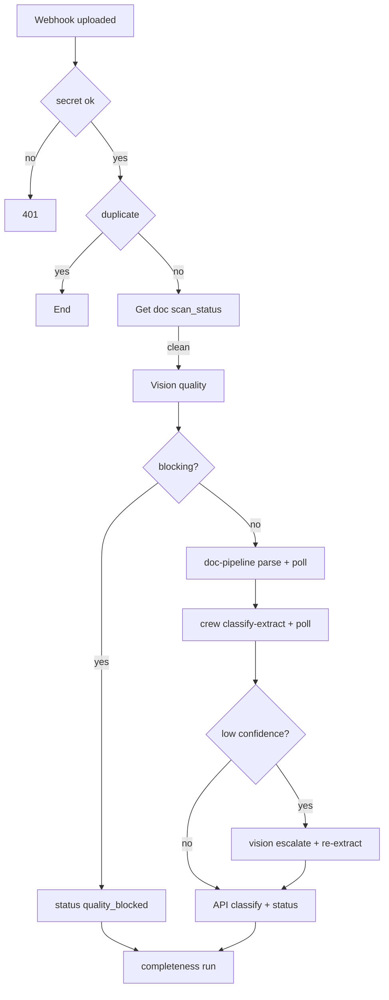

# 02-08 — hospital-n8n: Orchestration Flows

Status: PROPOSED. Owner: Dev A. Code: `hospital/n8n/flows/*.json`, `hospital/n8n/build_flows.py`, `hospital/n8n/README.md`, compose services `hospital-n8n` (UI/webhook, 5678) and `hospital-n8n-worker`.

## 1. Goal
Implement the long-running, retryable orchestration as n8n workflows: document intake pipeline, completeness loop, claim build + submission watch, query loop, reminders, stuck-work sweeper and global error handling. n8n only orchestrates. It calls hospital-api, hospital-crew, doc-pipeline and vision-service with a service account and holds no business rules or business data of its own (principle 1: deterministic logic lives in the API; principle 7: fixable before fatal, so every failure ends in a visible state a human can act on).

Design stance:
- **Event-driven, not loop-driven.** Re-entry happens because the API emits a webhook after an upload, an edit or a callback. There are no `while` loops and no multi-day Wait nodes.
- **n8n is replaceable.** All state transitions are API calls guarded by API-side state checks, so a lost or duplicated execution never corrupts a case.
- **Crews never hold API credentials.** n8n forwards crew results to the API (PROPOSED, decision D1 in §5.F3).
- **Flows are code.** Workflow JSON is generated by `build_flows.py`, committed, reviewed in PRs, and imported at boot.

## 2. Inputs / Outputs
- In: webhooks from hospital-api, cron triggers, short Wait-node resumes (< 24 h).
- Out: HTTP calls to internal API endpoints (docs 03, 04, 06, 07), crew jobs (doc 09), doc-pipeline and vision-service calls, reminder notifications (SMTP/MailHog in dev, in-app via API), execution logs retained 14 days.

| Direction | Peer | Purpose |
|---|---|---|
| hospital-api → n8n | webhooks | trigger flows |
| n8n → hospital-api | `/v1/internal/*` with service token | all state changes |
| n8n → hospital-crew | `/v1/jobs/*` | LLM-backed tasks |
| n8n → doc-pipeline | `/v1/parse`, `/v1/jobs/{id}` | parsing |
| n8n → vision-service | `/v1/quality`, `/v1/escalate` | quality and VLM fallback |
| n8n → Redis | `SETNX` idempotency keys | duplicate suppression |
| n8n → SMTP | reminders | MailHog in dev |

## 3. Data model
- n8n's own schema lives in a separate database `n8n` inside the `hospital-db` server, role `n8n_app`, never the hospital schema. The n8n role has no grants on hospital tables.
- Credentials are encrypted with `N8N_ENCRYPTION_KEY`. Workflow JSON references credential IDs only.
- Redis (queue mode via Bull) plus idempotency keys `n8n:idem:{workflow}:{key}` (TTL 1 h).
- Workflow JSON is versioned in git; import via CLI at boot: `n8n import:workflow --separate --input=/flows` then `n8n update:workflow --all --active=true`.

Naming and IDs (stable, so re-imports update in place):

| Flow | Workflow name | Stable ID |
|---|---|---|
| F1 | `hosp-intake-document` | `hosp_f1_intake` |
| F2 | `hosp-completeness-loop` | `hosp_f2_completeness` |
| F3 | `hosp-claim-build` | `hosp_f3_build` |
| F4 | `hosp-submission-watch` | `hosp_f4_submission_watch` |
| F5a | `hosp-query-intake` | `hosp_f5a_query_intake` |
| F5b | `hosp-query-draft` | `hosp_f5b_query_draft` |
| F5c | `hosp-query-sla-check` | `hosp_f5c_query_sla` |
| F6 | `hosp-reminders` | `hosp_f6_reminders` |
| F7 | `hosp-stuck-sweeper` | `hosp_f7_sweeper` |
| F8 | `hosp-global-error` | `hosp_f8_error` |
| U1 | `util-auth-token` | `hosp_u1_auth` |
| U2 | `util-idempotency` | `hosp_u2_idem` |
| U3 | `util-poll-job` | `hosp_u3_poll` |

## 4. Webhook / API surface

| Webhook (n8n) | Called by | Payload | Responds |
|---|---|---|---|
| `POST /webhook/intake/document-uploaded` | hospital-api | `{case_id, document_id, correlation_id}` | 200 `{accepted:true}` immediately (respond-early) |
| `POST /webhook/completeness/changed` | hospital-api | `{case_id, correlation_id}` | 200 |
| `POST /webhook/claim/build` | hospital-api | `{case_id, requested_by, correlation_id}` | 200 |
| `POST /webhook/claim/submitted` | hospital-api | `{case_id, claim_ref}` | 200 |
| `POST /webhook/query/intake` | hospital-api | `{query_id}` | 200 |
| `POST /webhook/query/draft` | hospital-api | `{query_id, requested_by}` | 200 |
| Cron `*/2 * * * *` | n8n | none | sweeper for stuck documents (F7) |
| Cron `*/5 * * * *` | n8n | none | reminders due (F6) |
| Cron `0 * * * *` | n8n | none | query SLA check (F5c) |

Webhook auth: header `X-Webhook-Secret` (shared with API, `N8N_WEBHOOK_SECRET`) checked in the first node (IF + Respond 401). Idempotency: node 2 calls U2 which runs Redis `SET key 1 NX EX 3600`; duplicates exit with 200 `{duplicate:true}`.

Idempotency key derivation per flow:

| Flow | Key |
|---|---|
| F1 | `document_id + ":" + parse_attempt` (API sends `attempt` in payload) |
| F2 | `case_id + ":" + floor(now/10s)` (debounce) |
| F3 | `case_id + ":" + build_version` |
| F4 | `claim_ref` |
| F5a | `query_id + ":intake"` |
| F5b | `query_id + ":draft:" + draft_seq` |

### Internal API endpoints n8n depends on (owned by docs 03-07; listed here so contract tests can assert them)

| Method + path | Doc | Used in |
|---|---|---|
| `GET /v1/documents/{id}` | 03 | F1 |
| `POST /v1/internal/documents/{id}/quality` | 03 | F1 |
| `POST /v1/internal/documents/{id}/parse` | 03 | F1 |
| `POST /v1/internal/documents/{id}/classify` | 03 | F1 |
| `POST /v1/internal/documents/{id}/status` | 03 | F1, F7, F8 |
| `POST /v1/internal/cases/{id}/completeness/run` | 04 | F1, F2 |
| `POST /v1/internal/cases/{id}/notify` | 07 | F2, F3, F4 |
| `POST /v1/internal/cases/{id}/claim/build-start` | 06 | F3 |
| `POST /v1/internal/cases/{id}/claim/draft` | 06 | F3 |
| `GET /v1/cases/{id}/submission` | 06 | F4 |
| `GET /v1/internal/queries/{id}` | 07 | F5a |
| `POST /v1/internal/queries/{id}/triage-result` | 07 | F5a |
| `GET /v1/internal/queries/{id}/context` | 07 | F5b |
| `POST /v1/internal/queries/{id}/draft-result` | 07 | F5b |
| `GET /v1/internal/reminders/due` | 04 | F6 |
| `POST /v1/internal/reminders/{id}/fired` | 04 | F6 |
| `GET /v1/internal/documents/stuck` | 03 | F7 |
| `POST /v1/internal/ops/events` | 02 | F8 |

## 5. Flows (node-by-node design)

Common node conventions:
- Every HTTP node sets header `X-Correlation-Id: {{$json.correlation_id}}` and `Authorization: Bearer {{$('Get Token').item.json.access_token}}`.
- Node names are prefixed with the step number (`01 Webhook`, `02 Idempotency`) so execution logs read as a trace.
- Timeouts: API 10 s, crew submit 15 s, crew job total 120 s, parse total 300 s.
- Retry: 3 attempts, 2 s then 4 s backoff on 5xx / timeout; never retry 4xx.

### Utility sub-workflows

**U1 `util-auth-token`** (Execute Workflow Trigger)
1. `Cache Get` (Redis GET `n8n:token:svc-n8n`).
2. IF present and `expires_at - now > 30s` → return it.
3. HTTP POST `${KEYCLOAK_TOKEN_URL}` `grant_type=client_credentials`, client `svc-n8n`.
4. Redis SET with TTL `expires_in - 30`; return `{access_token, expires_at}`.

**U2 `util-idempotency`**
1. Input `{workflow, key}`.
2. Redis `SET n8n:idem:{workflow}:{key} 1 NX EX 3600`.
3. Return `{duplicate: !ok}`.

**U3 `util-poll-job`** (for doc-pipeline and crew)
Input `{base_url, job_id, interval_s, max_wait_s, ok_states, fail_states}`.
1. `Set` counter `elapsed=0`.
2. `Wait` interval_s.
3. HTTP GET `{base_url}/v1/jobs/{job_id}`.
4. Switch on `state`: `succeeded` → return result; `failed` → return `{failed:true, error}`; else `elapsed += interval_s`; IF `elapsed >= max_wait_s` return `{timeout:true}` else back to step 2. (A bounded poll inside one sub-workflow, no unbounded loop; bounded by `max_wait_s`.)

### F1 `intake-document` (webhook `document-uploaded`)

| # | Node (type) | Config / call | On success | On failure |
|---|---|---|---|---|
| 01 | Webhook | POST `/webhook/intake/document-uploaded`, respond-early 200 | → 02 | n/a |
| 02 | IF secret | header equals `$env.N8N_WEBHOOK_SECRET` | → 03 | Respond 401, END |
| 03 | Execute U2 | key `document_id:attempt` | IF duplicate → END | continue |
| 04 | Execute U1 | token | → 05 | → F8 |
| 05 | HTTP GET | `$env.HOSP_API_URL/v1/documents/{{document_id}}` | → 06 | retry 3× → 90 |
| 06 | Switch | `scan_status` | `clean` → 07; `pending` → Wait 10 s → 05 (max 6 via counter); `infected`/`error` → END | |
| 07 | HTTP POST | vision `/v1/quality` `{document_id, presigned_url}` | → 08 | continue-on-fail, retry 3×, set `quality=null` |
| 08 | HTTP POST | API `/v1/internal/documents/{id}/quality` | → 09 | → 90 |
| 09 | IF | `quality.blocking == true` (flags `blurry`, `unreadable`, `blank`, `too_dark`) | true → 70 (raise needs-info path) | false → 10 |
| 10 | HTTP POST | doc-pipeline `/v1/parse` `{document_id, presigned_url, pass:1}` → `{job_id}` | → 11 | → 90 |
| 11 | Execute U3 | doc-pipeline job, interval 5 s, max 300 s | → 12 | timeout/failed → 90 |
| 12 | HTTP POST | API `/v1/internal/documents/{id}/parse` `{pass:1, result}` | → 13 | → 90 |
| 13 | HTTP POST | crew `/v1/jobs/classify-extract` `{document_id, expected_types, vision_hints}` → `{job_id}` | → 14 | → 90 |
| 14 | Execute U3 | crew job, interval 3 s, max 120 s | → 15 | fail → 90 |
| 15 | IF | `result.low_confidence or result.agreement_low` and `$env.VISION_ESCALATION=true` | true → 16 | false → 18 |
| 16 | HTTP POST | vision `/v1/escalate` `{document_id}` → VLM text/fields | → 17 | continue, mark `escalation_failed` |
| 17 | HTTP POST | crew `/v1/jobs/classify-extract` (second, with `vlm_text`) + U3 | → 18 | continue with first result |
| 18 | HTTP POST | API `/v1/internal/documents/{id}/classify` `{doc_type, passes, issues}` (API computes agreement, doc 03) | → 19 | → 90 |
| 19 | HTTP POST | API `/v1/internal/documents/{id}/status` `{parse_status}` | → 20 | → 90 |
| 20 | HTTP POST | API `/v1/internal/cases/{case}/completeness/run` (debounced server side) | END | → 90 |
| 70 | HTTP POST | API `/v1/internal/documents/{id}/status` `{parse_status:"quality_blocked"}` | → 20 | |
| 90 | HTTP POST | API `/v1/internal/documents/{id}/status` `{parse_status:"failed", error}` + F8 notify | END | |

Pseudo mermaid (also goes in README):


Error semantics: any failure at nodes 05-19 lands in node 90, which sets `parse_status=failed` with `error_code` (`parse_timeout`, `crew_failed`, `api_unavailable`, `vision_failed`). The desk can press "re-parse" in the UI (doc 10) which re-emits the webhook with `attempt+1`. F7 re-triggers automatically at most 5 times (cap enforced by API).

### F2 `completeness-loop` (webhook `completeness/changed`)

| # | Node | Detail |
|---|---|---|
| 01 | Webhook + secret + U2 | debounce key 10 s buckets |
| 02 | HTTP POST | `/v1/internal/cases/{id}/completeness/run` → `{status, missing[], blockers[], open_requests[]}` |
| 03 | IF `status == "complete"` | true → 04; false → 06 |
| 04 | HTTP POST | `/v1/internal/cases/{id}/notify` `{event:"completeness.complete"}` (SSE) |
| 05 | IF `$env.AUTO_BUILD=="true"` (also case config `auto_build`) | true → Execute F3 via HTTP POST own webhook `/webhook/claim/build`; false → END |
| 06 | Split In Batches over `open_requests` where `reminder_scheduled=false` | one item per request |
| 07 | HTTP POST | `/v1/internal/doc-requests/{id}/schedule-reminder` (API owns schedule; n8n only fires later) |
| 08 | HTTP POST | `/v1/internal/cases/{id}/notify` `{event:"completeness.updated"}` |

No loops inside n8n: re-entry is event-driven by uploads, preventing infinite cycles. Completeness never rejects a claim; it produces needs-info requests (principle 7).

### F3 `claim-build` (webhook `claim/build`)

| # | Node | Detail |
|---|---|---|
| 01 | Webhook + secret + U2 | key `case_id:build_version` |
| 02 | HTTP POST | `/v1/internal/cases/{id}/claim/build-start` → `{case_facts, doc_ids, route, build_version}`; API locks case, sets `building_claim` |
| 03 | IF 409 | already building → END |
| 04 | HTTP POST | crew `/v1/jobs/claim-build` → `{job_id}` |
| 05 | Execute U3 | interval 5 s, max 120 s |
| 06 | IF failed/timeout | → 12 |
| 07 | HTTP POST | forward result to API `/v1/internal/cases/{id}/claim/draft` `{draft, provenance, supervisor_verdict, build_version}` (D1: crews hold no API credentials) |
| 08 | IF response `validation.errors.length>0` and `repair_round < 2` | true → 09 |
| 09 | HTTP POST | crew `/v1/jobs/claim-repair` `{draft, errors}` + U3 → loop to 07 with `repair_round+1` (bounded counter, max 2) |
| 10 | IF still errors | → 11 |
| 11 | HTTP POST | `/v1/internal/cases/{id}/notify` `{event:"claim.needs_attention", errors}`; END (Officer fixes manually) |
| 12 | HTTP POST | `/v1/internal/cases/{id}/claim/build-failed` `{reason}`; notify Officer; END |

Human sign-off is outside n8n. The API's sign-off + submit endpoints run the outbox (doc 06). The state `building_claim` is cleared by node 07/12 (API side) so F7 can detect staleness.

### F4 `submission-watch` (webhook `claim/submitted`)
1. Webhook + secret + U2 (key `claim_ref`).
2. Wait 15 min.
3. GET `/v1/cases/{id}/submission` → `{status, acknowledged_at, attempts}`.
4. IF `acknowledged_at` set → END.
5. Else POST `/v1/internal/cases/{id}/notify` `{event:"submission.unacknowledged", minutes:elapsed}` (banner event).
6. Counter < 32 (8 h) → back to 2 (the Wait < 24 h rule holds; each execution total < 8 h).
7. Counter ≥ 32 → POST `/v1/internal/ops/events` severity=high (escalate to admin) and END.
The outbox worker (retry, backoff, dead-letter) lives in the API for reliability; n8n is only the watchdog.

### F5 `query-loop`

**F5a `hosp-query-intake`** (webhook `query/intake`)
1. Webhook + secret + U2.
2. GET `/v1/internal/queries/{id}` → `{round, category, text, requested_doc_types, due_by, case_summary}`.
3. HTTP POST crew `/v1/jobs/query-triage` + U3 (max 60 s).
4. IF crew failed → POST API triage-result with `{fallback:true, class: category_default[category]}` (deterministic mapping, doc 07).
5. Else POST API `/triage-result` `{class, urgency, needs_docs, auto_draftable, rationale}`.
6. IF `auto_draftable` and `round < 3` and `category not in sensitive_categories` → HTTP POST own `/webhook/query/draft`.
7. Else POST `/notify` `{event:"query.needs_owner", role:"officer"}`.

**F5b `hosp-query-draft`** (webhook `query/draft`)
1. Webhook + secret + U2 (key `query_id:draft:seq`).
2. GET `/v1/internal/queries/{id}/context` (API builds package: case summary, relevant parsed docs excerpts masked, prior rounds).
3. HTTP POST crew `/v1/jobs/query-draft` + U3 (max 180 s).
4. IF failed → POST `/v1/internal/queries/{id}/draft-result` `{failed:true}`; notify; END (human writes it).
5. POST `/draft-result` `{draft_text, citations, attach_suggestions, unsupported_claims, supervisor_verdict}` → API grounding guard re-verifies and emits SSE `query.draft_ready`.
6. END. The human wait is not a Wait node (§8).

**F5c `hosp-query-sla-check`** (cron hourly)
1. GET `/v1/internal/queries/due-soon?within_hours=24` → list.
2. For each: IF no response yet and no reminder in last 12 h → POST `/v1/internal/reminders` `{kind:"query_sla", query_id}`.
3. For overdue: notify Officer + Admin.

### F6 `reminders` (cron `*/5 * * * *`)
1. Cron → U1.
2. GET `/v1/internal/reminders/due?limit=50` → items `{id, kind, case_id, channel, to, template, vars}`.
3. Split In Batches (size 10).
4. Switch on `channel`: `email` → SMTP node (MailHog dev); `in_app` → POST `/v1/internal/notifications`.
5. POST `/v1/internal/reminders/{id}/fired` `{result}`; on send failure POST `/failed` (API increments attempts, caps at 3).
Kinds handled: `doc_request`, `query_sla`, `reimbursement_filing_deadline`, `emergency_intimation`, `submission_unacknowledged`.

### F7 `stuck-sweeper` (cron `*/2 * * * *`)
1. GET `/v1/internal/documents/stuck?older_than=2m` → `[ {document_id, case_id, parse_status, attempts} ]`.
2. For each with `attempts < 5`: HTTP POST own webhook `/webhook/intake/document-uploaded` with `attempt = attempts+1`.
3. For `attempts >= 5`: POST status `failed` + notify desk with action text "re-upload a clearer copy".
4. GET `/v1/internal/cases/stale-building?older_than=15m` → mark `build-failed` (POST) and notify Officer.
5. GET `/v1/internal/outbox/stalled` → notify admin.

### F8 `global-error` (Error Trigger)
1. Error Trigger (set as error workflow of all flows).
2. POST `/v1/internal/ops/events` `{workflow, execution_id, node, error, correlation_id}`.
3. Langfuse tag via crew `/v1/ops/tag` (best-effort) or log node.
4. IF severity high → SMTP admin email.

## 6. Build tasks
1. **Compose:** `hospital-n8n` (main) + `hospital-n8n-worker` with `EXECUTIONS_MODE=queue`, `QUEUE_BULL_REDIS_HOST=redis`, `DB_TYPE=postgresdb`, `DB_POSTGRESDB_DATABASE=n8n`, `N8N_ENCRYPTION_KEY`, `WEBHOOK_URL`, `N8N_BASIC_AUTH_ACTIVE` or Keycloak reverse proxy, `EXECUTIONS_DATA_PRUNE=true`, `EXECUTIONS_DATA_MAX_AGE=336`, `N8N_PAYLOAD_SIZE_MAX=16`, `GENERIC_TIMEZONE=Asia/Kolkata`, `mem_limit 768m` main, `512m` worker.
   - Files: `infra/compose/hospital.yml`, `hospital/n8n/Dockerfile` (extends `n8nio/n8n`, copies `/flows`, `entrypoint.sh`).
   - `entrypoint.sh`: wait for DB, import credentials then flows, activate, then `exec n8n start`.
2. **Credential bootstrap** `hospital/n8n/bootstrap.sh` + `credentials.template.json`: Keycloak client-credentials (OAuth2 generic or manual token via U1), webhook secret, SMTP, Redis. Never commit a filled credentials file.
3. **Sub-workflows** U1-U3 built first (they are imported before F1-F8; names stable).
4. **Python builder** `hospital/n8n/build_flows.py`: small DSL to define nodes/connections, assigns deterministic node IDs (`uuid5(namespace, flow+name)`), writes `hospital/n8n/flows/<id>.json`. Helpers: `http(name, method, url_expr, body, retries=3, timeout=10000)`, `switch(...)`, `if_(...)`, `execute_wf(...)`, `respond(...)`. A CI step regenerates and fails on diff.
5. **Environment URLs** via n8n env (`$env.HOSP_API_URL`, `$env.HOSP_CREW_URL`, `$env.DOCPIPE_URL`, `$env.VISION_URL`), no hard-coded hosts.
6. **Retry policy:** HTTP nodes retry 3× with 2 s backoff; "Continue on error" only where an error branch exists; timeouts per node as in §5.
7. **Smoke script** `hospital/n8n/tests/n8n_smoke.py`: starts a stub server (FastAPI or `responses`) that implements the endpoints of §4, fires each webhook, polls for completion, asserts the exact ordered call list against golden files in `tests/golden/*.json`.
8. **Flow diagrams** (mermaid) per flow in `hospital/n8n/README.md`, plus a table of webhook → secret → payload.
9. **CI lint** `scripts/lint_flows.py`: no credential values (grep `Bearer `, `password`, `secret` values), every webhook path listed in §4, every HTTP URL starts with `={{$env.`, every flow has error workflow F8, no Wait node > 24 h, node names unique per flow.
10. **Backup/restore:** `hospital/n8n/export.sh` (`n8n export:workflow --backup`, `export:credentials --decrypted=false`) and restore doc.
11. **Healthcheck:** `/healthz` on n8n; compose `depends_on` redis, hospital-db healthy.
12. **Observability:** include `correlation_id` in every outbound call; `N8N_LOG_LEVEL=info`, JSON logs; execution IDs surfaced in F8.

## 7. Config / env vars
| Var | Example | Notes |
|---|---|---|
| `N8N_ENCRYPTION_KEY` | 32+ random chars | required, kept in `.env` |
| `WEBHOOK_URL` | `http://hospital-n8n:5678/` | internal |
| `HOSP_API_URL` | `http://hospital-api:8000` | |
| `HOSP_CREW_URL` | `http://hospital-crew:8010` | |
| `DOCPIPE_URL` | `http://doc-pipeline:8200` | |
| `VISION_URL` | `http://vision-service:8300` | |
| `KEYCLOAK_TOKEN_URL` | `http://keycloak:8080/realms/hospital/protocol/openid-connect/token` | |
| `N8N_WEBHOOK_SECRET` | random | shared with API |
| `SMTP_HOST/PORT` | `mailhog:1025` | dev |
| `QUEUE_WORKER_CONCURRENCY` | `5` | RAM-conscious |
| `VISION_ESCALATION` | `true` | feature flag |
| `AUTO_BUILD` | `false` | PROPOSED default off; Officer starts build |
| `INTAKE_MAX_PARSE_WAIT_S` | `300` | |

## 8. Error handling and edge cases
| Situation | Behaviour |
|---|---|
| n8n restarts mid-execution | Queue mode persists executions; flows idempotent via keys and API-side state checks. |
| doc-pipeline timeout on large PDFs | Poll up to 300 s then `parse_status=failed (parse_timeout)`; desk can re-parse; sweeper retries up to 5. |
| Vision/doc service down | Retries, then `failed` + SSE; sweeper retries later (cap 5). |
| Duplicate webhooks | U2 idempotency node exits. |
| Token expiry mid-flow | U1 invoked before each API call group; U1 caches in Redis with margin. |
| Version drift in API paths | `n8n_smoke` fails CI when internal paths change; paths listed in §4. |
| Long waits | Avoided; F4 total ≤ 8 h by bounded counter; human waits are API-triggered, not n8n Wait nodes. |
| Secret hygiene | JSON committed without credentials (IDs only); lint enforces. |
| Crew returns invalid shape | API rejects (422); node 90/12 marks failure; Officer sees message. |
| Poisoned document (prompt injection) | Handled in crew (doc 09); n8n only passes IDs and masked text references. |
| Double claim-build click | F3 key + API 409 on `building_claim`. |
| Worker OOM | Concurrency 5 and `mem_limit`; stuck executions swept by F7; n8n `EXECUTIONS_TIMEOUT=900`. |
| Clock skew | Cron times use n8n server tz; API computes deadlines (n8n never computes dates). |
| API down for minutes | HTTP retry then node 90; F7 recovers when API returns. |

## 9. Tests
Test matrix (all in `hospital/n8n/tests/`, run via `make n8n-test` against compose or a bare n8n container + stub server):

| ID | Scenario | Expected |
|---|---|---|
| T01 | Valid upload of clean PDF | calls in order: GET doc, vision quality, API quality, parse, poll, API parse, crew, poll, API classify, status, completeness |
| T02 | Blurry image | stops after quality, status `quality_blocked`, completeness called |
| T03 | Infected file | no downstream calls |
| T04 | Scan pending then clean | waits, then continues |
| T05 | Doc-pipeline stays running 400 s | `failed` with `parse_timeout` |
| T06 | Crew returns 500 thrice | `failed` with `crew_failed` |
| T07 | Low agreement | vision escalate called once, second extraction |
| T08 | Duplicate webhook within 1 h | second exits, no calls |
| T09 | Wrong secret | 401, no calls |
| T10 | Completeness complete, AUTO_BUILD true | build webhook fired |
| T11 | Completeness incomplete | reminders scheduled for open requests only |
| T12 | Claim build ok, validation clean | no repair call |
| T13 | Validation errors twice | 2 repair calls then notify |
| T14 | Crew build timeout | build-failed endpoint called |
| T15 | Submission never acknowledged | banner event at 15 min, escalation after 8 h (time mocked) |
| T16 | Query triage crew failure | fallback triage posted |
| T17 | Round 3 query | no auto draft, owner notified |
| T18 | Reminders due 12 items | batches of 10, fired callbacks |
| T19 | Sweeper finds doc attempts=5 | status failed, no re-trigger |
| T20 | Any node error | F8 posts ops event |

Additional: load test (30 uploads concurrent with concurrency 5, all done < 10 min with stubs); import/export round-trip determinism (generated JSON identical); kill worker mid-parse and restart completes without duplicate API effects.

### 9.1 Payload examples (used as stub and golden fixtures)

Webhook `document-uploaded`:
```json
{"case_id":"0199a1b2-0000-7000-8000-0000000000c1","document_id":"0199a1b2-0000-7000-8000-0000000000d1","attempt":1,"correlation_id":"corr-7f3a"}
```
doc-pipeline parse response (job accepted, then finished):
```json
{"job_id":"pj-91","state":"running"}
{"job_id":"pj-91","state":"succeeded","result":{"pages":3,"parser_confidence":0.93,"text_masked_ref":"s3://hospital-docs/parsed/d1.json","tables":2}}
```
crew `classify-extract` accepted / finished:
```json
{"job_id":"cj-12"}
{"job_id":"cj-12","state":"succeeded","result":{"doc_type":"discharge_summary","classify_confidence":0.97,"issues":[],"passes":[{"pass_no":1},{"pass_no":2}]}}
```
API classify body forwarded by n8n:
```json
{"doc_type":"discharge_summary","passes":[{"pass_no":1,"typed":{},"model_info":{"alias":"extract-fast"}},{"pass_no":2,"typed":{},"model_info":{"alias":"draft-main"}}],"issues":[],"vision_escalated":false}
```
API completeness response consumed by F2:
```json
{"status":"incomplete","missing":["itemised_bill"],"blockers":["itemised_bill"],"open_requests":[{"id":"rq-1","doc_type":"itemised_bill","reminder_scheduled":false}]}
```

### 9.2 Golden call order (T01)
```
POST /webhook/intake/document-uploaded            (n8n, in)
GET  /v1/documents/{id}                           (api)
POST vision /v1/quality
POST /v1/internal/documents/{id}/quality          (api)
POST doc-pipeline /v1/parse
GET  doc-pipeline /v1/jobs/pj-91   (xN polls)
POST /v1/internal/documents/{id}/parse            (api)
POST crew /v1/jobs/classify-extract
GET  crew /v1/jobs/cj-12           (xN polls)
POST /v1/internal/documents/{id}/classify         (api)
POST /v1/internal/documents/{id}/status           (api, parse_status=parsed)
POST /v1/internal/cases/{case}/completeness/run   (api)
```
The smoke test compares method + path + selected body keys (not timing), and ignores the number of polls.

### 9.3 Builder DSL sketch (`build_flows.py`)
```python
flow = Flow("hosp-intake-document", id="hosp_f1_intake", error_workflow="hosp_f8_error")
wh = flow.webhook("01 Webhook", path="intake/document-uploaded", respond="immediately")
sec = flow.if_(
    "02 Secret", left="={{$json.headers['x-webhook-secret']}}", right="={{$env.N8N_WEBHOOK_SECRET}}"
)
idem = flow.execute(
    "03 Idempotency",
    workflow="hosp_u2_idem",
    params={"workflow": "f1", "key": "={{$json.body.document_id + ':' + $json.body.attempt}}"},
)
doc = flow.http(
    "05 Get doc",
    "GET",
    "={{$env.HOSP_API_URL}}/v1/documents/{{$json.body.document_id}}",
    retries=3,
    timeout=10000,
)
flow.connect(wh, sec)
flow.connect(sec.true, idem)
flow.connect(sec.false, flow.respond("Respond 401", 401))
flow.write("hospital/n8n/flows/")  # deterministic node ids via uuid5
```
Generated HTTP node (abridged):
```json
{"id":"b0f1...","name":"05 Get doc","type":"n8n-nodes-base.httpRequest","typeVersion":4,
 "parameters":{"method":"GET","url":"={{$env.HOSP_API_URL}}/v1/documents/{{$json.body.document_id}}",
   "sendHeaders":true,"headerParameters":{"parameters":[
     {"name":"Authorization","value":"=Bearer {{$('Get Token').item.json.access_token}}"},
     {"name":"X-Correlation-Id","value":"={{$json.body.correlation_id}}"}]},
   "options":{"timeout":10000}},
 "retryOnFail":true,"maxTries":3,"waitBetweenTries":2000,"onError":"continueErrorOutput"}
```

### 9.4 Operational checks after deploy
1. `n8n list:workflow` shows 13 workflows, all active (F1-F8 incl. F5a-c, U1-U3).
2. Execute `curl -X POST .../webhook/intake/document-uploaded` with a wrong secret: expect 401.
3. Open the n8n UI behind Keycloak proxy; confirm no credentials are visible in exported JSON.
4. Pause the API container for 60 s during an upload: the flow ends `failed` and the sweeper recovers it after the API returns.
5. Check Redis keys `n8n:idem:*` have TTL set (no immortal keys).

## 10. Acceptance criteria
- [ ] Fresh `make up-hospital` imports and activates all flows automatically.
- [ ] Uploading a document drives it to classified/parsed with correct API calls (verified via smoke T01).
- [ ] Killing the worker mid-parse and restarting finishes the job without duplicates.
- [ ] No secrets in committed JSON; lint passes; all flows documented with diagrams.
- [ ] T01-T20 pass in CI.
- [ ] No Wait node over 24 h; no unbounded loop (lint rule).

## 11. Dependencies
Docs 02-07 internal endpoints (§4 table); doc 09 crew job endpoints; shared services doc-pipeline and vision (04-shared-services 02, 03); Redis, Keycloak (04-shared-services 01); contract docs 01-01 (correlation) and 01-04 (audit events are written by the API, not n8n).

## 12. Claude Code kickoff prompt
> Implement docs/implementation/02-dev-A-hospital/08-n8n-flows.md: compose + bootstrap first (tasks 1-3), then `build_flows.py` and export flows U1-U3 and F1-F8 as JSON files built against the stub server, plus the smoke script and lint (tasks 4-9). Because n8n flows are authored visually, generate valid workflow JSON programmatically via the Python builder so they are reviewable in git. Implement tests T01-T20 before declaring a flow done.
