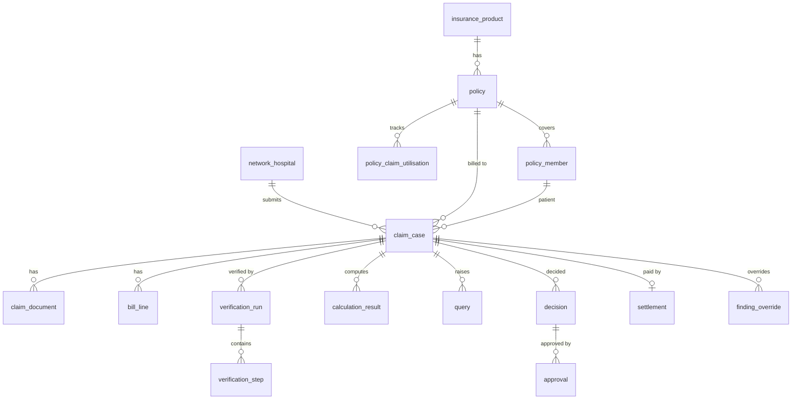

# 03-01 — insurer-db: Schema, Migrations, Roles, Seed Data

Owner: Dev B. Status: PROPOSED. Container: `insurer-db` (PostgreSQL 16, port 5433).
Depends on: `01-shared-contract/02-data-models-and-enums.md`, `03-config-versioning.md`, `04-audit-hash-chain.md`, `05-repo-layout-and-conventions.md`.

## 1. Goal
Provide the single relational store for the insurer system: received claims, verification results, queries, decisions, approvals, settlements, policy master data, versioned config, idempotency records, outbox and the hash-chained audit log. No other system reads this DB (hospital never; crews never write directly — they return Pydantic objects the API persists).

## 2. Inputs / Outputs
- Inputs: Alembic migrations in `insurer/api/alembic/versions/`, seed scripts in `insurer/api/seed/`, SQLAlchemy 2 async models in `insurer/api/app/models/`.
- Outputs: a migrated database `insurer` with schemas `core`, `config`, `audit`, `ops`; three DB roles; seeded policies, members, hospitals, config versions and users mapping.

## 3. Data model

### 3.1 Conventions
- PK `id UUID` (uuid7 generated by app; `uuid_generate_v7()` fallback SQL function for seeds).
- `created_at`, `updated_at timestamptz NOT NULL DEFAULT now()`; `updated_at` maintained by trigger `set_updated_at()`.
- Money columns `NUMERIC(14,2)`; never float. Percent columns `NUMERIC(5,2)`.
- Enum types are Postgres ENUMs mirroring `claim_contract.enums` (generated by a script, see task 4) — values listed in 02-data-models doc.
- Soft delete is not used; claims are never deleted (retention requirement). Withdrawn claims get status `closed` with `closure_reason`.

### 3.2 Schemas and DDL

```sql
CREATE EXTENSION IF NOT EXISTS pgcrypto;
CREATE EXTENSION IF NOT EXISTS pg_trgm;
CREATE SCHEMA core; CREATE SCHEMA config; CREATE SCHEMA audit; CREATE SCHEMA ops;

CREATE FUNCTION set_updated_at() RETURNS trigger AS $$
BEGIN NEW.updated_at = now(); RETURN NEW; END $$ LANGUAGE plpgsql;
```

#### Master data (`core`)
```sql
CREATE TABLE core.insurance_product (
  id UUID PRIMARY KEY,
  code TEXT UNIQUE NOT NULL,              -- e.g. 'HEALTH-PLUS-GOLD'
  name TEXT NOT NULL,
  insurer_name TEXT NOT NULL,
  active BOOLEAN NOT NULL DEFAULT true,
  created_at timestamptz NOT NULL DEFAULT now(), updated_at timestamptz NOT NULL DEFAULT now()
);

CREATE TABLE core.policy (
  id UUID PRIMARY KEY,
  policy_number TEXT UNIQUE NOT NULL,
  product_id UUID NOT NULL REFERENCES core.insurance_product(id),
  policy_holder_name TEXT NOT NULL,
  start_date DATE NOT NULL, end_date DATE NOT NULL,
  sum_insured NUMERIC(14,2) NOT NULL CHECK (sum_insured > 0),
  cumulative_bonus NUMERIC(14,2) NOT NULL DEFAULT 0,
  status TEXT NOT NULL CHECK (status IN ('active','lapsed','cancelled','suspended')),
  premium_paid_until DATE,
  grace_days INT NOT NULL DEFAULT 30,
  created_at timestamptz NOT NULL DEFAULT now(), updated_at timestamptz NOT NULL DEFAULT now(),
  CHECK (end_date > start_date)
);
CREATE INDEX ix_policy_status ON core.policy(status);

CREATE TABLE core.policy_member (
  id UUID PRIMARY KEY,
  policy_id UUID NOT NULL REFERENCES core.policy(id),
  member_id TEXT UNIQUE NOT NULL,         -- as printed on card
  full_name TEXT NOT NULL,
  full_name_norm TEXT NOT NULL,           -- lower, stripped, for matching (see 08-crew)
  dob DATE NOT NULL,
  gender CHAR(1) NOT NULL CHECK (gender IN ('M','F','O')),
  relationship TEXT NOT NULL,             -- self, spouse, child, parent
  id_proof_hash TEXT,                     -- SHA-256 only
  cover_start DATE NOT NULL,              -- may differ from policy start (added mid-term)
  pre_existing TEXT[] NOT NULL DEFAULT '{}',  -- ICD-10 prefixes declared at inception
  created_at timestamptz NOT NULL DEFAULT now(), updated_at timestamptz NOT NULL DEFAULT now()
);
CREATE INDEX ix_member_policy ON core.policy_member(policy_id);
CREATE INDEX ix_member_name_trgm ON core.policy_member USING gin (full_name_norm gin_trgm_ops);

CREATE TABLE core.policy_claim_utilisation (   -- running balance used by calc engine
  id UUID PRIMARY KEY,
  policy_id UUID NOT NULL REFERENCES core.policy(id),
  policy_year INT NOT NULL,
  utilised_amount NUMERIC(14,2) NOT NULL DEFAULT 0,
  UNIQUE (policy_id, policy_year)
);

CREATE TABLE core.network_hospital (
  id UUID PRIMARY KEY,
  hospital_code TEXT UNIQUE NOT NULL,      -- matches ClaimSubmission.admission.hospital_id
  name TEXT NOT NULL, city TEXT, rohini_id TEXT,
  network_status TEXT NOT NULL CHECK (network_status IN ('network','non_network','blacklisted')),
  room_rent_tier TEXT,                     -- tier for city-based caps
  empanelment_valid_till DATE,
  hmac_key_id TEXT UNIQUE NOT NULL         -- links X-Key-Id to hospital
);
```

#### Claims (`core`)
```sql
CREATE TYPE core.insurer_case_status AS ENUM
 ('received','verifying','needs_info','ready_for_decision','awaiting_approval',
  'approved','partially_approved','rejected','escalated','settled','closed');

CREATE TABLE core.claim_case (
  id UUID PRIMARY KEY,
  insurer_claim_no TEXT UNIQUE NOT NULL,                 -- IC-2026-000123 via sequence
  hospital_claim_ref TEXT NOT NULL,
  hospital_id UUID NOT NULL REFERENCES core.network_hospital(id),
  claim_type TEXT NOT NULL CHECK (claim_type IN ('cashless','reimbursement')),
  admission_type TEXT NOT NULL CHECK (admission_type IN ('planned','emergency')),
  status core.insurer_case_status NOT NULL DEFAULT 'received',
  policy_id UUID REFERENCES core.policy(id),
  member_id UUID REFERENCES core.policy_member(id),
  claimed_amount NUMERIC(14,2) NOT NULL,
  recommended_amount NUMERIC(14,2),
  approved_amount NUMERIC(14,2),
  contract_version TEXT NOT NULL,
  submission JSONB NOT NULL,                              -- full ClaimSubmission as received
  submission_hash CHAR(64) NOT NULL,
  received_at timestamptz NOT NULL,
  assigned_reviewer TEXT,                                  -- keycloak sub
  priority SMALLINT NOT NULL DEFAULT 3,                    -- 1 high .. 5 low
  sla_due_at timestamptz,
  closure_reason TEXT,
  last_callback_seq BIGINT NOT NULL DEFAULT 0,             -- sequence sent to hospital
  created_at timestamptz NOT NULL DEFAULT now(), updated_at timestamptz NOT NULL DEFAULT now(),
  UNIQUE (hospital_id, hospital_claim_ref)
);
CREATE INDEX ix_case_status ON core.claim_case(status, priority, sla_due_at);
CREATE INDEX ix_case_reviewer ON core.claim_case(assigned_reviewer) WHERE status IN ('verifying','needs_info','ready_for_decision');

CREATE TABLE core.claim_document (
  id UUID PRIMARY KEY,                                    -- = hospital doc_id
  case_id UUID NOT NULL REFERENCES core.claim_case(id),
  doc_type TEXT NOT NULL, filename TEXT NOT NULL,
  sha256 CHAR(64) NOT NULL, size_bytes BIGINT NOT NULL, pages INT NOT NULL,
  object_key TEXT,                                         -- insurer-docs bucket key
  fetch_status TEXT NOT NULL DEFAULT 'pending' CHECK (fetch_status IN ('pending','fetched','failed','hash_mismatch')),
  fetch_attempts INT NOT NULL DEFAULT 0,
  parse_confidence NUMERIC(4,3),
  superseded_by UUID REFERENCES core.claim_document(id),
  added_via_query UUID,                                    -- query_id that requested it
  created_at timestamptz NOT NULL DEFAULT now()
);
CREATE INDEX ix_doc_case ON core.claim_document(case_id);

CREATE TABLE core.bill_line (
  id UUID PRIMARY KEY, case_id UUID NOT NULL REFERENCES core.claim_case(id),
  line_no INT NOT NULL, code TEXT, description TEXT NOT NULL,
  category TEXT NOT NULL, qty NUMERIC(10,2) NOT NULL,
  unit_price NUMERIC(14,2) NOT NULL, amount NUMERIC(14,2) NOT NULL,
  source_doc_id UUID REFERENCES core.claim_document(id), source_page INT,
  UNIQUE (case_id, line_no)
);
```

#### Verification (`core`)
```sql
CREATE TABLE core.verification_run (
  id UUID PRIMARY KEY, case_id UUID NOT NULL REFERENCES core.claim_case(id),
  run_no INT NOT NULL, trigger TEXT NOT NULL,   -- 'initial','query_response','manual_rerun','config_change'
  status TEXT NOT NULL CHECK (status IN ('running','completed','failed')),
  started_at timestamptz NOT NULL DEFAULT now(), finished_at timestamptz,
  config_versions JSONB NOT NULL,
  UNIQUE (case_id, run_no)
);

CREATE TABLE core.verification_step (
  id UUID PRIMARY KEY, run_id UUID NOT NULL REFERENCES core.verification_run(id),
  step TEXT NOT NULL CHECK (step IN ('document_fetch','completeness','identity','authenticity','coverage','calculation')),
  status TEXT NOT NULL CHECK (status IN ('pending','running','passed','flagged','failed','skipped')),
  score NUMERIC(4,3),                  -- deterministic score where defined
  findings JSONB NOT NULL DEFAULT '[]',-- list of Finding{code,severity,message,evidence}
  agent_output JSONB,                  -- validated Pydantic dump from crew
  trace_id TEXT, started_at timestamptz, finished_at timestamptz,
  UNIQUE (run_id, step)
);

CREATE TABLE core.calculation_result (
  id UUID PRIMARY KEY, case_id UUID NOT NULL REFERENCES core.claim_case(id),
  run_id UUID REFERENCES core.verification_run(id),
  engine_version TEXT NOT NULL, policy_rules_version INT NOT NULL,
  input JSONB NOT NULL, output JSONB NOT NULL,   -- CalcInput / CalcResult (see 07)
  payable_amount NUMERIC(14,2) NOT NULL,
  created_at timestamptz NOT NULL DEFAULT now()
);
```

#### Queries, decisions, settlement (`core`)
```sql
CREATE TABLE core.query (
  id UUID PRIMARY KEY, case_id UUID NOT NULL REFERENCES core.claim_case(id),
  round SMALLINT NOT NULL CHECK (round BETWEEN 1 AND 3),
  category TEXT NOT NULL, text TEXT NOT NULL,
  requested_doc_types TEXT[] NOT NULL DEFAULT '{}',
  status TEXT NOT NULL CHECK (status IN ('open','draft_ready','answered','closed','escalated')),
  origin TEXT NOT NULL CHECK (origin IN ('agent_draft','human','scripted')),
  draft_text TEXT, draft_citations JSONB,
  raised_by TEXT, due_by timestamptz NOT NULL,
  sent_at timestamptz, answered_at timestamptz,
  response JSONB,                                    -- QueryResponse as received
  triage JSONB,                                      -- triage outcome of response
  callback_seq BIGINT,
  created_at timestamptz NOT NULL DEFAULT now(), updated_at timestamptz NOT NULL DEFAULT now()
);
CREATE INDEX ix_query_case ON core.query(case_id, round);

CREATE TABLE core.decision (
  id UUID PRIMARY KEY, case_id UUID NOT NULL REFERENCES core.claim_case(id),
  kind TEXT NOT NULL CHECK (kind IN ('recommendation','final')),
  outcome TEXT NOT NULL CHECK (outcome IN ('approve','partial','reject','needs_info')),
  approved_amount NUMERIC(14,2), reason_codes TEXT[] NOT NULL DEFAULT '{}',
  deductions JSONB NOT NULL DEFAULT '[]', explanation TEXT,
  calc_result_id UUID REFERENCES core.calculation_result(id),
  gate_tier TEXT CHECK (gate_tier IN ('single','dual')),   -- derived from thresholds
  config_versions JSONB NOT NULL,
  created_by TEXT NOT NULL, created_at timestamptz NOT NULL DEFAULT now()
);

CREATE TABLE core.approval (
  id UUID PRIMARY KEY, decision_id UUID NOT NULL REFERENCES core.decision(id),
  approver TEXT NOT NULL, verdict TEXT NOT NULL CHECK (verdict IN ('approve','reject','return')),
  comment TEXT, approver_role TEXT NOT NULL,
  created_at timestamptz NOT NULL DEFAULT now(),
  UNIQUE (decision_id, approver)           -- one vote per person: enforces two distinct approvers
);

CREATE TABLE core.settlement (
  id UUID PRIMARY KEY, case_id UUID UNIQUE NOT NULL REFERENCES core.claim_case(id),
  amount NUMERIC(14,2) NOT NULL, mode TEXT NOT NULL DEFAULT 'neft_sim',
  utr TEXT UNIQUE, status TEXT NOT NULL CHECK (status IN ('initiated','paid','failed','reversed')),
  initiated_at timestamptz, paid_at timestamptz, failure_reason TEXT
);
```

#### Config (`config`) — per `03-config-versioning.md`
```sql
CREATE TABLE config.config_set (
  id UUID PRIMARY KEY, domain TEXT NOT NULL, name TEXT NOT NULL,
  scope_key TEXT NOT NULL DEFAULT '*',          -- e.g. product code for policy_rules
  created_by TEXT NOT NULL, created_at timestamptz NOT NULL DEFAULT now(),
  UNIQUE (domain, name, scope_key)
);
CREATE TABLE config.config_version (
  id UUID PRIMARY KEY, config_set_id UUID NOT NULL REFERENCES config.config_set(id),
  version INT NOT NULL, status TEXT NOT NULL CHECK (status IN ('draft','published','retired')),
  payload JSONB NOT NULL, checksum CHAR(64) NOT NULL,
  effective_from timestamptz, effective_to timestamptz,
  created_by TEXT NOT NULL, published_by TEXT, second_approver TEXT,
  created_at timestamptz NOT NULL DEFAULT now(),
  UNIQUE (config_set_id, version),
  EXCLUDE USING gist (config_set_id WITH =, tstzrange(effective_from, effective_to) WITH &&)
    WHERE (status = 'published')
);
-- requires btree_gist extension
CREATE FUNCTION config.forbid_published_update() RETURNS trigger AS $$
BEGIN
  IF OLD.status = 'published' AND (NEW.payload <> OLD.payload OR NEW.version <> OLD.version OR NEW.checksum <> OLD.checksum) THEN
    RAISE EXCEPTION 'published config_version is immutable';
  END IF; RETURN NEW; END $$ LANGUAGE plpgsql;
CREATE TRIGGER trg_cfg_immutable BEFORE UPDATE ON config.config_version
  FOR EACH ROW EXECUTE FUNCTION config.forbid_published_update();
```
Insurer domains: `policy_rules` (scope = product code), `thresholds`, `query_policy`, `doc_requirements`.

#### Audit (`audit`) — per `04-audit-hash-chain.md`
```sql
CREATE TABLE audit.audit_event (
  id UUID PRIMARY KEY, seq BIGINT NOT NULL, case_id UUID NOT NULL,
  ts timestamptz NOT NULL, actor_type TEXT NOT NULL, actor_id TEXT NOT NULL,
  event_type TEXT NOT NULL, payload JSONB NOT NULL,
  config_versions JSONB, model_info JSONB,
  prev_hash CHAR(64) NOT NULL, hash CHAR(64) NOT NULL,
  UNIQUE (case_id, seq)
);
CREATE TABLE audit.case_audit_head (case_id UUID PRIMARY KEY, last_seq BIGINT NOT NULL, last_hash CHAR(64) NOT NULL);
CREATE TABLE audit.audit_anchor (day DATE PRIMARY KEY, merkle_root CHAR(64) NOT NULL, event_count BIGINT NOT NULL, object_key TEXT);
CREATE FUNCTION audit.forbid_mutation() RETURNS trigger AS $$
BEGIN RAISE EXCEPTION 'audit_event is append-only'; END $$ LANGUAGE plpgsql;
CREATE TRIGGER trg_audit_no_upd BEFORE UPDATE OR DELETE ON audit.audit_event
  FOR EACH ROW EXECUTE FUNCTION audit.forbid_mutation();
```

#### Ops (`ops`)
```sql
CREATE TABLE ops.idempotency_record (
  key_id TEXT NOT NULL, idempotency_key UUID NOT NULL,
  request_hash CHAR(64) NOT NULL, response_status INT NOT NULL, response_body JSONB NOT NULL,
  created_at timestamptz NOT NULL DEFAULT now(),
  PRIMARY KEY (key_id, idempotency_key)
);
CREATE TABLE ops.outbox (                 -- callbacks to hospital
  id UUID PRIMARY KEY, case_id UUID NOT NULL, endpoint TEXT NOT NULL,
  payload JSONB NOT NULL, seq BIGINT NOT NULL, idempotency_key UUID NOT NULL,
  status TEXT NOT NULL CHECK (status IN ('pending','sent','dead')),
  attempts INT NOT NULL DEFAULT 0, next_attempt_at timestamptz NOT NULL DEFAULT now(),
  last_error TEXT, created_at timestamptz NOT NULL DEFAULT now(), sent_at timestamptz
);
CREATE INDEX ix_outbox_due ON ops.outbox(next_attempt_at) WHERE status='pending';
CREATE TABLE ops.user_profile (            -- mirror of keycloak identities for display and assignment
  sub TEXT PRIMARY KEY, display_name TEXT NOT NULL, email TEXT, roles TEXT[] NOT NULL,
  active BOOLEAN NOT NULL DEFAULT true, last_seen_at timestamptz
);
CREATE SEQUENCE ops.claim_no_seq START 1;
```

### 3.3 Claim-number generation
`insurer_claim_no = 'IC-' || extract(year from now()) || '-' || lpad(nextval('ops.claim_no_seq')::text, 6, '0')`. Sequence does not reset per year (PROPOSED; uniqueness over prettiness).

### 3.4 DB roles
| Role | Rights |
|---|---|
| `ins_owner` | DDL, used only by Alembic |
| `ins_app` | SELECT/INSERT/UPDATE on `core`, `config`, `ops`; INSERT+SELECT only on `audit.audit_event`, SELECT/INSERT/UPDATE on `audit.case_audit_head`; no DELETE anywhere except `ops.idempotency_record`, `ops.outbox` (sent rows) |
| `ins_readonly` | SELECT everywhere (reporting, eval harness) |

### 3.5 Columns and tables added by sibling docs (migration `0008_additions.py`, PROPOSED)
These are required by other docs in this folder and are consolidated here so there is one schema owner.

```sql
-- 02-api-claim-receipt: per-hospital callback target
ALTER TABLE core.network_hospital ADD COLUMN callback_base_url TEXT;           -- e.g. https://hospital-api:8000
ALTER TABLE core.network_hospital ADD COLUMN active BOOLEAN NOT NULL DEFAULT true;

-- 03-api-case-verification-orchestration
ALTER TABLE core.claim_case ADD COLUMN latest_run_id UUID REFERENCES core.verification_run(id);
ALTER TABLE core.claim_case ADD COLUMN degraded BOOLEAN NOT NULL DEFAULT false;      -- LLM unavailable during a run
ALTER TABLE core.claim_case ADD COLUMN sla_breached BOOLEAN NOT NULL DEFAULT false;
ALTER TABLE core.claim_case ADD COLUMN procedure_group TEXT;                         -- derived at receipt, drives doc_requirements
ALTER TABLE core.claim_case ADD COLUMN etag BIGINT NOT NULL DEFAULT 1;               -- optimistic concurrency, bumped by trigger
CREATE FUNCTION core.bump_etag() RETURNS trigger AS $$
BEGIN NEW.etag = OLD.etag + 1; RETURN NEW; END $$ LANGUAGE plpgsql;
CREATE TRIGGER trg_case_etag BEFORE UPDATE ON core.claim_case FOR EACH ROW EXECUTE FUNCTION core.bump_etag();

CREATE TABLE core.finding_override (
  id UUID PRIMARY KEY, case_id UUID NOT NULL REFERENCES core.claim_case(id),
  run_id UUID NOT NULL REFERENCES core.verification_run(id),
  finding_key TEXT NOT NULL,                 -- sha256(step||code||evidence_ref)
  finding_code TEXT NOT NULL,
  reason TEXT NOT NULL CHECK (length(reason) >= 10),
  overridden_by TEXT NOT NULL, role TEXT NOT NULL,
  created_at timestamptz NOT NULL DEFAULT now(),
  UNIQUE (case_id, finding_key)
);

-- 05-api-query-loop-escalation
ALTER TABLE core.query ADD COLUMN dedupe_key CHAR(64);                                -- hash(sorted codes + doc types)
CREATE UNIQUE INDEX ux_query_open_dedupe ON core.query(case_id, dedupe_key) WHERE status IN ('open','draft_ready');
ALTER TABLE core.query ADD COLUMN reminder_count SMALLINT NOT NULL DEFAULT 0;

-- 04-api-decision-gate
ALTER TABLE core.decision ADD COLUMN supersedes UUID REFERENCES core.decision(id);
ALTER TABLE core.decision ADD COLUMN status TEXT NOT NULL DEFAULT 'proposed'
  CHECK (status IN ('proposed','awaiting_approval','finalised','returned','withdrawn'));
```

### 3.6 JSONB column contracts
Every JSONB column has a Pydantic model in `insurer/api/app/models/jsonschemas.py`; repositories validate on write and the migration adds `CHECK (jsonb_typeof(col) = 'object' OR 'array')`.

| Column | Model | Shape |
|---|---|---|
| `claim_case.submission` | `ClaimSubmission` | full contract payload; never mutated after insert |
| `verification_run.config_versions` | `InsurerConfigVersions` | `{"doc_requirements":3,"thresholds":2,"policy_rules":5,"query_policy":1,"calc_engine":"1.4.2"}` |
| `verification_step.findings` | `list[Finding]` | see 03 doc §3 |
| `verification_step.agent_output` | per-step `AgentOutput` | includes `agent`, `prompt_version`, `trace_id`, `degraded` |
| `calculation_result.input/output` | `CalcInput` / `CalcResult` | see 07-calc-engine |
| `decision.deductions` | `list[Deduction]` | `[{"line_no":12,"rule_id":"room_rent_cap","amount":"4500.00","explanation":"..."}]` |
| `query.response` | `QueryResponse` | as received from hospital |
| `query.triage` | `TriageResult` | `{"verdict":"resolved\|partial\|unresponsive","resolved_findings":[...],"remaining":[...],"agent":{...}}` |
| `ops.outbox.payload` | contract callback model | validated on enqueue |

### 3.7 Reporting views (read-only, used by insurer-ui dashboards and the eval harness)
```sql
CREATE VIEW core.v_case_list AS
SELECT c.id, c.insurer_claim_no, c.hospital_claim_ref, h.name AS hospital_name, c.claim_type, c.admission_type,
       c.status, c.priority, c.claimed_amount, c.recommended_amount, c.approved_amount,
       c.assigned_reviewer, c.sla_due_at, c.sla_breached, c.received_at, c.updated_at,
       m.full_name AS member_name, p.policy_number
FROM core.claim_case c
JOIN core.network_hospital h ON h.id = c.hospital_id
LEFT JOIN core.policy_member m ON m.id = c.member_id
LEFT JOIN core.policy p ON p.id = c.policy_id;

CREATE VIEW core.v_reviewer_load AS
SELECT assigned_reviewer, count(*) FILTER (WHERE status IN ('verifying','needs_info','ready_for_decision')) AS open_cases,
       count(*) FILTER (WHERE sla_breached) AS breached
FROM core.claim_case WHERE assigned_reviewer IS NOT NULL GROUP BY assigned_reviewer;

CREATE VIEW core.v_query_aging AS
SELECT q.case_id, q.id AS query_id, q.round, q.status, q.due_by,
       GREATEST(now() - q.due_by, interval '0') AS overdue_by
FROM core.query q WHERE q.status IN ('open','draft_ready');
```
The `ins_readonly` role gets SELECT on these views; the UI list endpoint reads `v_case_list` so the heavy `submission` blob is never loaded.

### 3.8 Index plan (beyond those inline)
| Index | Purpose |
|---|---|
| `ix_case_hospital_ref (hospital_id, hospital_claim_ref)` | satisfied by the UNIQUE constraint |
| `ix_case_member_dates ON core.claim_case(member_id, received_at)` | duplicate-claim detection |
| `ix_case_sla ON core.claim_case(sla_due_at) WHERE status NOT IN ('settled','closed','rejected')` | SLA tick |
| `ix_step_run ON core.verification_step(run_id)` | workspace load |
| `ix_decision_case ON core.decision(case_id, created_at DESC)` | latest decision |
| `ix_audit_case ON audit.audit_event(case_id, seq)` | satisfied by UNIQUE |
| `ix_doc_sha ON core.claim_document(sha256)` | detect same file re-used across claims (authenticity heuristic `auth.duplicate_document`) |
| `ix_bill_case ON core.bill_line(case_id)` | calc input load |

### 3.9 ERD (mermaid, also exported to `assets/insurer-erd.md`)


### 3.10 Retention and archival (PROPOSED)
- Claims, decisions, audit: retained 8 years (synthetic data, but documented to show intent). No deletes.
- `ops.idempotency_record`: purged after 7 days by nightly job (`DELETE ... WHERE created_at < now() - interval '7 days'`).
- `ops.outbox` rows in `sent` older than 30 days purged; `dead` rows retained until acknowledged by admin.
- Large JSONB (`submission`, `agent_output`) are TOAST-compressed; no partitioning for the project's scale (< 100k claims). If needed later, partition `audit.audit_event` by `ts` month.

## 4. API/endpoints
None directly. Exposed to the API via SQLAlchemy models and repository classes (`insurer/api/app/repos/`). Health: `GET /v1/health` in insurer-api checks `SELECT 1` and migration head.

## 5. Build tasks
1. Create `insurer/api/` with `pyproject.toml`, `app/db.py` (async engine from `INS_DATABASE_URL`, pool 10, `statement_cache_size=0` disabled if using pgbouncer later).
2. Initialise Alembic (`alembic init -t async alembic`), `env.py` loads `INS_OWNER_DATABASE_URL`, `target_metadata` from `app/models/__init__.py`.
3. Migration `0001_extensions_schemas_roles.py`: extensions (`pgcrypto`, `pg_trgm`, `btree_gist`), schemas, `set_updated_at`, roles and default privileges.
4. Script `scripts/gen_enums.py` emitting Postgres ENUM and SQLAlchemy `Enum` definitions from `claim_contract.enums`; CI check that generated file is up to date.
5. Migration `0002_core_master.py`: product, policy, member, utilisation, network_hospital with indexes.
6. Migration `0003_core_claims.py`: claim_case, claim_document, bill_line.
7. Migration `0004_core_verification.py`: run, step, calculation_result.
8. Migration `0005_core_queries_decisions.py`: query, decision, approval, settlement.
9. Migration `0006_config.py`: config_set, config_version, exclusion constraint, immutability trigger.
10. Migration `0007_audit_ops.py`: audit tables, triggers, head, anchor, idempotency, outbox, user_profile, sequence.
11. Attach `set_updated_at` trigger to every table with `updated_at` (loop in migration helper `add_updated_at_trigger(table)`).
12. SQLAlchemy 2 models (`Mapped[...]`) per table; `uuid7` default factory (`from uuid_utils import uuid7`).
13. Repository layer: `ClaimRepo`, `PolicyRepo`, `QueryRepo`, `DecisionRepo`, `ConfigRepo`, `OutboxRepo`, `AuditRepo` (thin, return domain objects; no business logic).
14. Seed scripts (`seed/`): `01_products_policies.py`, `02_members.py`, `03_hospitals.py`, `04_config_defaults.py`, `05_users.py`; deterministic via `Faker.seed(42)`; make idempotent using upsert on natural keys.
15. `make seed-insurer` and `make migrate-insurer` Makefile targets.
16. Backup/restore helper `scripts/pg_dump_insurer.sh`.
17. Migration `0008_additions.py` per §3.5 (callback_base_url, latest_run_id, degraded, sla_breached, procedure_group, etag trigger, finding_override, query dedupe, decision status) and `0009_views.py` per §3.7; add the indexes of §3.8.
18. Retention job `jobs/purge_ops.py` (Arq cron nightly) per §3.10.
19. Export ERD (§3.9) with `scripts/export_erd.py` (sqlalchemy-schemadisplay or mermaid text from metadata) and a CI check that it is current.

## 6. Key logic / pseudocode

### 6.1 Seed default config (PROPOSED values)
```python
THRESHOLDS_V1 = {
    "t_auto": "50000.00",
    "t_four": "500000.00",
    "identity_min_score": 0.85,
    "authenticity_floor": 0.70,
    "name_similarity_min": 0.88,
    "dob_must_match": True,
}
QUERY_POLICY_V1 = {
    "max_rounds": 3,
    "round_sla_hours": [72, 48, 24],
    "escalation_role": "senior_reviewer",
    "reminder_offsets_hours": [24, 6],
}
POLICY_RULES_V1 = {  # product HEALTH-PLUS-GOLD, see 07-calc-engine for semantics
    "room_rent": {
        "type": "percent_of_si",
        "percent": "1.0",
        "icu_percent": "2.0",
        "per_day_cap": None,
    },
    "co_pay": {"percent": "10", "applies_to": ["senior_citizen"]},
    "deductible": {"amount": "0"},
    "sub_limits": {"cataract": "40000", "knee_replacement": "150000", "maternity": "75000"},
    "waiting_periods_days": {
        "initial": 30,
        "pre_existing": 730,
        "specific": {"cataract": 730, "hernia": 365},
    },
    "exclusions": ["Z41", "cosmetic", "O80_dental_cosmetic"],
    "proportionate_deduction": True,
    "network_discount_percent": "0",
    "non_network_co_pay_percent": "20",
}
```

### 6.2 Config resolution SQL
```sql
SELECT v.* FROM config.config_version v JOIN config.config_set s ON s.id=v.config_set_id
WHERE s.domain=$1 AND s.scope_key IN ($2,'*') AND v.status='published'
  AND v.effective_from <= $3 AND (v.effective_to IS NULL OR v.effective_to > $3)
ORDER BY (s.scope_key = $2) DESC, v.version DESC LIMIT 1;
```

### 6.3 Utilisation update must be atomic
`UPDATE core.policy_claim_utilisation SET utilised_amount = utilised_amount + $amt WHERE policy_id=$1 AND policy_year=$2 AND utilised_amount + $amt <= (SELECT sum_insured + cumulative_bonus FROM core.policy WHERE id=$1) RETURNING utilised_amount;` zero rows → raise `SumInsuredExhausted` (decision gate converts to partial).

### 6.4 Policy-year derivation
```python
def policy_year(policy_start: date, admitted_on: date) -> int:
    """1-based policy year containing admitted_on; renewal anniversaries on policy_start."""
    if admitted_on < policy_start:
        raise ValueError("admission before policy start")
    years = admitted_on.year - policy_start.year
    anniv = date(
        policy_start.year + years,
        policy_start.month,
        min(policy_start.day, 28 if policy_start.month == 2 else policy_start.day),
    )
    return years + 1 if admitted_on >= anniv else years
```
Edge: 29 Feb start dates use 28 Feb for non-leap anniversaries.

### 6.5 SQLAlchemy model and repository sample
```python
# insurer/api/app/models/claim.py
class ClaimCase(Base):
    __tablename__ = "claim_case"
    __table_args__ = {"schema": "core"}
    id: Mapped[UUID] = mapped_column(primary_key=True, default=uuid7)
    insurer_claim_no: Mapped[str] = mapped_column(unique=True)
    status: Mapped[InsurerCaseStatus] = mapped_column(
        Enum(InsurerCaseStatus, name="insurer_case_status", schema="core")
    )
    claimed_amount: Mapped[Decimal] = mapped_column(Numeric(14, 2))
    submission: Mapped[dict] = mapped_column(
        JSONB, deferred=True
    )  # deferred: never loaded in lists
    etag: Mapped[int] = mapped_column(BigInteger, default=1, server_default="1")
    __mapper_args__ = {"version_id_col": etag, "version_id_generator": False}


# insurer/api/app/repos/claim_repo.py
class ClaimRepo:
    def __init__(self, session: AsyncSession):
        self.s = session

    async def get(self, id: UUID, *, for_update=False) -> ClaimCase | None:
        q = select(ClaimCase).where(ClaimCase.id == id)
        return (await self.s.execute(q.with_for_update() if for_update else q)).scalar_one_or_none()

    async def get_by_ref(self, hospital_id, ref, *, for_update=False): ...
    async def next_claim_no(self) -> str:
        n = (await self.s.execute(text("SELECT nextval('ops.claim_no_seq')"))).scalar_one()
        return f"IC-{datetime.now(UTC).year}-{n:06d}"

    async def list_page(
        self, filters: CaseFilters, cursor: Cursor | None, limit=50
    ) -> Page[CaseListRow]:
        # keyset pagination on (priority, sla_due_at, id) from v_case_list
        ...
```
Repos never commit; the service layer owns the transaction boundary (`async with session.begin()`).

### 6.6 Seed data design
| Seed | Counts | Rules |
|---|---|---|
| products | 3 (`HEALTH-BASIC`, `HEALTH-PLUS-GOLD`, `SENIOR-SHIELD`) | each with a published `policy_rules` version |
| policies | 60 | 45 active, 5 lapsed, 5 suspended, 5 within grace window; sum insured from {3L, 5L, 10L, 25L} |
| members | 180 | 1-5 per policy; relationships weighted; 15% with `pre_existing` ICD prefixes; DOB spread 1940-2020; names via Faker `en_IN` |
| hospitals | 12 | 8 network, 3 non-network, 1 blacklisted; each has `hmac_key_id`, `callback_base_url` |
| users | 8 | 3 reviewers, 2 senior_reviewers, 2 approvers, 1 admin (mirrors Keycloak seed in 04-shared-services/01) |
| config | all four domains | v1 published, effective_from = `2026-01-01` |

Seeds key on natural keys (`policy_number`, `member_id`, `hospital_code`, `code`) and use `INSERT ... ON CONFLICT (natural_key) DO UPDATE`. The synthetic-data generator in `05-integration-and-eval/01-synthetic-data.md` must reuse these same members and policies so submissions match master data; it reads them from `seed/export/members.json` produced by `make seed-insurer`.

### 6.7 Migration helper for triggers
```python
# insurer/api/alembic/helpers.py
def add_updated_at_trigger(op, schema: str, table: str):
    op.execute(f"""CREATE TRIGGER trg_{table}_updated BEFORE UPDATE ON {schema}.{table}
                   FOR EACH ROW EXECUTE FUNCTION set_updated_at();""")


def drop_updated_at_trigger(op, schema, table):
    op.execute(f"DROP TRIGGER IF EXISTS trg_{table}_updated ON {schema}.{table}")
```

### 6.8 Role and grant script (migration 0001)
```sql
CREATE ROLE ins_app LOGIN PASSWORD :'app_pw'; CREATE ROLE ins_readonly LOGIN PASSWORD :'ro_pw';
GRANT USAGE ON SCHEMA core, config, audit, ops TO ins_app, ins_readonly;
GRANT SELECT, INSERT, UPDATE ON ALL TABLES IN SCHEMA core, config TO ins_app;
GRANT SELECT, INSERT ON audit.audit_event TO ins_app;
GRANT SELECT, INSERT, UPDATE ON audit.case_audit_head TO ins_app;
GRANT SELECT, INSERT ON audit.audit_anchor TO ins_app;
GRANT SELECT, INSERT, UPDATE, DELETE ON ops.idempotency_record, ops.outbox TO ins_app;
GRANT SELECT, INSERT, UPDATE ON ops.user_profile TO ins_app;
GRANT USAGE ON ALL SEQUENCES IN SCHEMA ops TO ins_app;
GRANT SELECT ON ALL TABLES IN SCHEMA core, config, audit, ops TO ins_readonly;
ALTER DEFAULT PRIVILEGES FOR ROLE ins_owner IN SCHEMA core, config GRANT SELECT, INSERT, UPDATE ON TABLES TO ins_app;
ALTER DEFAULT PRIVILEGES FOR ROLE ins_owner IN SCHEMA core, config, audit, ops GRANT SELECT ON TABLES TO ins_readonly;
```
`ins_app` explicitly has no `DELETE` on `core.*`; if a future feature needs one, add it to the table-specific grant with a comment.

## 7. Config / env vars
`INS_DATABASE_URL` (app role), `INS_OWNER_DATABASE_URL` (migrations), `INS_DB_POOL_SIZE=10`, `INS_DB_ECHO=false`, `POSTGRES_PASSWORD_INS_*` in `.env`. Compose: `mem_limit: 512m`, volume `insurer-db-data`, healthcheck `pg_isready -U ins_app -d insurer`.

## 8. Error handling and edge cases
- Duplicate `(hospital_id, hospital_claim_ref)` on insert → repo raises `DuplicateClaim`; API maps to idempotent replay or 409 (see 02).
- Policy year boundary: claim belongs to the policy year of `admitted_on`; derive `policy_year = year index since start_date`.
- Member added mid-term: `cover_start` governs waiting-period clock, not policy start.
- Overlapping published config windows rejected by exclusion constraint; migration includes test.
- Timezone: all `timestamptz`, stored UTC; dates (DOB, admission) are naive `date` in IST semantics.
- JSONB growth: `submission` can be large (up to 2 MB); do not select it in list queries (use column deferral).
- Migration rollback: every migration has a working `downgrade()` except `0001` (document it).
- Seeds must refuse to run when `INS_ENV=prod` (guard).

### 8.1 Additional edge cases
| Situation | Handling |
|---|---|
| Two workers call `next_claim_no` concurrently | Sequence is non-transactional; gaps are acceptable and documented, duplicates impossible |
| Rolled-back receipt consumed a claim number | Gap in numbering; auditors told gaps are expected |
| Enum change in `claim_contract` | `gen_enums.py` emits `ALTER TYPE ... ADD VALUE` migration; removal of a value requires a major contract bump and a data migration |
| `ALTER TYPE ADD VALUE` inside a transaction | Postgres < 12 restriction; on 16 it is allowed but the new value cannot be used in the same transaction; migration commits first (use `op.get_context().autocommit_block()`) |
| Member name with diacritics or initials | `full_name_norm` computed by `normalise_name()` (NFKD, strip accents, lower, collapse spaces, drop punctuation and honorifics); same function used at match time |
| Policy lapses mid-claim | Status read at verification time with `at = admitted_on`; policy history table not modelled (PROPOSED: `policy.status_history JSONB` appended by seed/admin tools) |
| Config set deleted while versions exist | FK prevents; admin can only `retire` versions |
| `ins_app` connection pool exhausted | API returns 503 `internal_error`; pool metrics exported (`db_pool_in_use`) |
| Time skew between DB and API host | All `now()` for business timestamps come from the API (`clock.now()` injected for tests); DB `now()` only for `created_at` defaults |
| Very large `bill_line` count (> 2,000) | Receipt validator rejects above 2,000 lines (422) to protect calc-engine |

## 9. Tests
- `tests/db/test_migrations.py`: upgrade head → downgrade base → upgrade head on testcontainers Postgres.
- `test_constraints.py`: bad enum, negative SI, overlapping config, duplicate approval vote, utilisation overflow.
- `test_audit_immutability.py`: UPDATE/DELETE as `ins_app` fails; as owner trigger still fails.
- `test_roles.py`: `ins_readonly` cannot write; `ins_app` cannot DROP.
- `test_seed_idempotent.py`: seed twice, counts unchanged.
- `test_config_resolution.py`: scope-specific beats `'*'`; past timestamp returns old version.

### 9.1 Test matrix
| Test file | Case | Expected |
|---|---|---|
| `test_constraints.py` | insert policy with `sum_insured = 0` | `CheckViolation` |
| | insert policy with `end_date <= start_date` | `CheckViolation` |
| | insert two approvals same decision + same approver | `UniqueViolation` |
| | insert query round 4 | `CheckViolation` |
| | two published config versions overlapping | `ExclusionViolation` |
| | UPDATE published config payload | exception `published config_version is immutable` |
| | UPDATE `status` published → retired | allowed |
| `test_audit_immutability.py` | `ins_app` UPDATE/DELETE audit_event | permission denied |
| | `ins_owner` UPDATE audit_event | trigger exception |
| `test_etag.py` | two sessions update same case | second gets `StaleDataError` |
| `test_claim_no.py` | 50 parallel `next_claim_no` | all unique, format regex matches |
| `test_policy_year.py` | boundaries: start day, day before anniversary, anniversary, 29 Feb | year indices per §6.4 |
| `test_views.py` | seed 5 cases; `v_case_list` row count, no `submission` column | pass |
| `test_seed_integrity.py` | every member has policy; every policy has product; every hospital has unique key id | pass |
| `test_downgrade.py` | `alembic downgrade -1` for each migration `0002..0008` | succeeds, schema diff empty vs previous head |
| `test_grants.py` | introspect `information_schema.role_table_grants` | matches §6.8 |

## 10. Acceptance criteria
- [ ] `make migrate-insurer && make seed-insurer` yields: ≥3 products, ≥50 policies, ≥150 members, ≥10 hospitals, published config for all four domains.
- [ ] Round-trip migration test green.
- [ ] Audit and config immutability proven by tests.
- [ ] ERD exported to `docs/implementation/03-dev-B-insurer/assets/insurer-erd.md` (mermaid) and matches migrations.

## 11. Dependencies
Needs: repo scaffold (01-05), enums (01-02), config pattern (01-03), audit pattern (01-04). Needed by: every other doc in this folder.

## 12. Claude Code kickoff prompt
> Read docs/implementation/01-shared-contract/* and docs/implementation/03-dev-B-insurer/01-insurer-db.md. Enter plan mode, then implement build tasks 1-16 in order under insurer/api/. Run the tests in section 9 after each migration. Do not add business logic. Stop at the acceptance criteria and list any deviation from the DDL.
