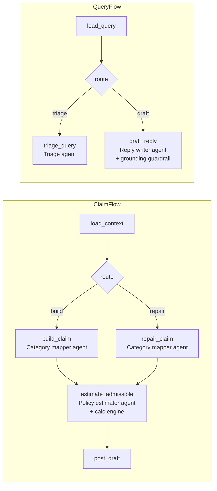

# hospital-crew

CrewAI flows and agents behind a small FastAPI service (`make run-crew`, port 8010, localhost only). The crew never
writes the database: it reads context from the hospital API with its own service token (`hospital-crew` client) and
posts results back to the API's internal endpoints, where the API re-validates everything.

## How CrewAI is used

| Job (`POST /v1/jobs/<job>`) | CrewAI Flow (`crew/flows.py`) | CrewAI agent (`crew/config/agents.yaml`) | Guardrail / deterministic code |
|---|---|---|---|
| `claim-build` | `ClaimFlow`: load_context → route → build_claim → estimate_admissible → post_draft | Category mapper (local model), only for lines the keyword table cannot label; Policy estimator (general model) | `tools/assemble.py` builds lines and totals; labels outside the allowed set are ignored; estimate: see below |
| `claim-repair` | `ClaimFlow`: load_context → route → repair_claim → estimate_admissible → post_draft | Category mapper, Policy estimator | totals recomputed in code; repair whitelist `tools/repair_paths.yaml` |
| `query-triage` | `QueryFlow`: load_query → route → triage_query | Query triage officer (general model) | rule-based risk flag can be raised, never lowered |
| `query-draft` | `QueryFlow`: load_query → route → draft_reply | Claims desk reply writer (general model) | grounding rules G01-G08 are the task guardrail (one retry with the complaints), supervisor checklist last |



- Every agent reaches the model through `crew/crewai_bridge.py:BridgeLLM`, which calls the crew's own clients
  (`crew/llm.py`): the PII guard runs before every call, the Ollama circuit breaker and JSON repair still apply, and
  `CREW_LLM=rules` runs the same flows and agents with no model.
- Each agent is one task in a sequential crew (`crew/team.py`); no delegation, no CrewAI memory or knowledge (both
  default to OpenAI embeddings), telemetry off (`CREWAI_TELEMETRY_OPT_OUT=true`).
- Model errors keep their own type through CrewAI (`max_retry_limit=0`), so job errors still read `pii_detected`,
  `llm_unavailable`, `schema_invalid`.

## Admissible-amount estimate (Policy Estimate step, `crew/estimate.py`)

Before the officer signs off, every built or repaired draft carries an estimate of what the insurer will pay:

1. **Policy terms from the policy card**: product and sum insured (doc-pipeline fields `product_name`, `sum_insured`).
2. **Policy wording from the hospital's knowledge base**: rag-service collection `hosp_insurer_rules`, filtered by
   product and the admission date (`HOSP_RAG_URL`; the token is minted from `RAG_JWT_SECRET`). The hospital token cannot
   read the insurer's collections.
3. **Policy estimator agent (CrewAI)** reports room rent %, ICU %, co-pay % and the procedure sub-limit, each with a
   verbatim quote. Guardrail: the quote must be copied from the wording and contain the number (one retry with the
   problems). A code parser of the same wording overrides any number it can read (`term_overridden_by_code`).
4. **The insurer's calculation engine** (`calc_engine`, as a library) computes claimed, eligible, estimated payable and
   patient share, with non-medical items excluded and the room cap, sub-limit and co-pay applied.

Waiting periods and exclusions need the insurer's member history, so the estimate assumes they pass and says so. It is
advice, never a gate: anything missing gives `status: "unavailable"` with the reason, and the draft is posted anyway.
hospital-api stores it (`claim_draft.estimate`) and the officer's claim page shows it with the quoted terms.

## Run

```bash
make crew-demo                     # crewai run: the three flows on built-in synthetic data, no model needed
CREW_LLM=ollama make crew-demo     # same with the real local model (HOSP_LLM_* in .env)
make crew-plot                     # flow diagrams (HTML) into docs/diagrams/
make run-crew                      # the service the hospital API and n8n call
```

Guards: PII regex before every model call (Aadhaar, PAN, e-mail, phone), grounding rules G01-G08 (same numbers as the
API's guard, so a draft that passes here passes there), a deterministic supervisor (payment promises, liability,
medical advice, links, instruction-like text), repair whitelist (`tools/repair_paths.yaml`).
Prompts are versioned files (`crew/prompts/<name>/v<N>.md`); `CREW_PROMPT_PIN_<NAME>=v1` pins a version.

Tests: `uv run pytest hospital/crew` (no network; `tests/test_crewai_flows.py` covers the flows),
`hospital/api/tests/test_crew_integration.py` (real crew + real API, fake model), `pytest -m llm` (live Ollama, opt-in).
