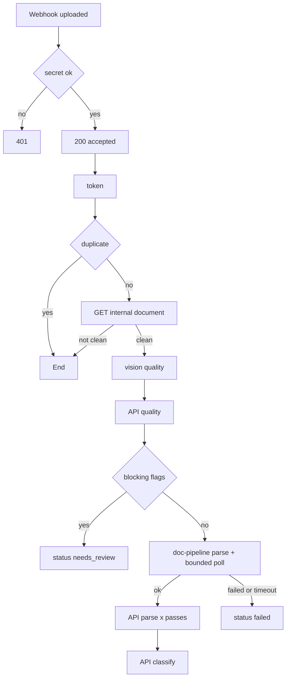

# hospital-n8n: orchestration flows

n8n only orchestrates. Every state change is an API call guarded by API-side state checks, so a lost or duplicated
execution never corrupts a case. The flows are generated: edit `build_flows.py`, run `make flows` (generate + lint),
commit the JSON. `hospital/n8n/tests/test_lint.py` fails if the committed JSON differs from what the builder produces.

```
make flows        # regenerate + lint
make up-n8n       # n8n on :5688 (host network), flows imported and activated at boot
make n8n-test     # real n8n container (port 5693) + stub services; needs docker and the n8nio/n8n:2.41.6 image
```

## Flows

| Id | Name | Trigger | What it does |
|---|---|---|---|
| `hosp_f1_intake` | hosp-intake-document | webhook `intake/document-uploaded` | scan check → vision quality → doc-pipeline parse (poll) → API parse passes → classify |
| `hosp_f2_completeness` | hosp-completeness-loop | webhook `completeness/changed` | notify the UI (the API evaluates completeness itself) |
| `hosp_f3_build` | hosp-claim-build | cron 5 min, `jobs/claim-build` | returns stuck builds to `docs_complete` (the API starts the crew itself) |
| `hosp_f4_submission_watch` | hosp-submission-watch | webhook `claim/submitted` | banner after 15 min, high-severity ops event after 8 h if not acknowledged |
| `hosp_f5a_query_intake` | hosp-query-intake | webhook `query/intake` | crew triage (poll) → API; auto-draft only for round < 3, no escalation risk |
| `hosp_f5b_query_draft` | hosp-query-draft | webhook `query/draft` | starts a crew draft job |
| `hosp_f5c_query_sla` | hosp-query-sla-check | cron hourly, `jobs/query-sla` | API marks overdue queries (100% only, no 50/80% reminders) |
| `hosp_f6_reminders` | hosp-reminders | cron 5 min, `jobs/reminders` | fires due in-app reminders in batches of 10 |
| `hosp_f7_sweeper` | hosp-stuck-sweeper | cron 2 min, `jobs/sweeper` | re-triggers stuck documents, tells the admin about stalled outbox rows |
| `hosp_f8_error` | hosp-global-error | error trigger | reports to `/v1/internal/ops/events` |
| `hosp_u1_auth` / `u2_idem` / `u3_poll` | utilities | sub-workflow | service token, idempotency (API-side Redis SET NX), bounded job poll |

Every webhook needs `X-Webhook-Secret` (`N8N_WEBHOOK_SECRET`, shared with the API) and answers 200 immediately.
Duplicates are dropped through `POST /v1/internal/idempotency` using the `X-Idempotency-Key` header the API sends.



## Webhook table

| Path | Payload | Notes |
|---|---|---|
| `intake/document-uploaded` | `{case_id, document_id}` | key = `X-Idempotency-Key` |
| `completeness/changed` | `{case_id}` | 10 s debounce key |
| `claim/submitted` | `{case_id}` | sent by the API after `submit` |
| `query/intake` | `{query_id}` | sent after a query callback |
| `query/draft` | `{query_id, case_id}` | |
| `jobs/{reminders,sweeper,query-sla,claim-build}` | `{}` | run a cron flow on demand |

## Environment

`HOSP_API_URL`, `HOSP_CREW_URL`, `DOCPIPE_URL`, `VISION_URL`, `KEYCLOAK_TOKEN_URL`, `N8N_WEBHOOK_SECRET`,
`N8N_CLIENT_SECRET` (the `hospital-n8n` Keycloak client), `N8N_ENCRYPTION_KEY`, `INTAKE_MAX_PARSE_WAIT_S`.
No credentials are stored in the flows; secrets come from the container environment.
Backup: `docker exec claims-hospital-n8n-1 n8n export:workflow --backup --output=/tmp/wf` (flows are in git anyway).

## Gotchas learned the hard way

- n8n ends an expression at the first `}}`: never write nested object literals as `{a: {b: 1}}` inside `{{ }}`
  (the builder rejects it).
- Use `$('Node').first().json`, not `.item`, on error branches (paired-item resolution fails there).
- Task-runner and webhook ports clash with other n8n instances on the same host: set `N8N_RUNNERS_BROKER_PORT`.
